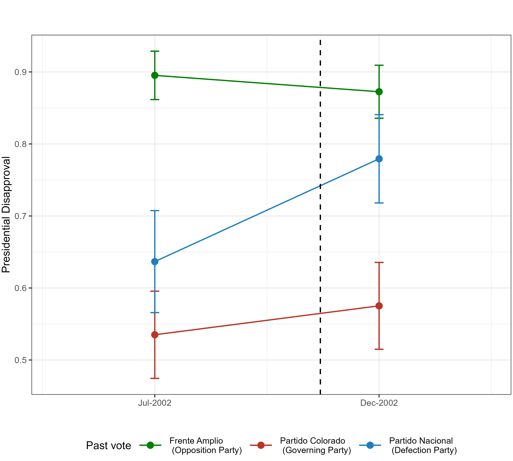
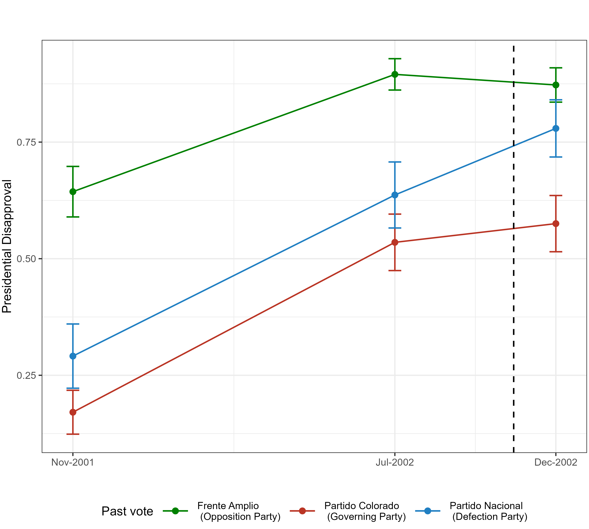
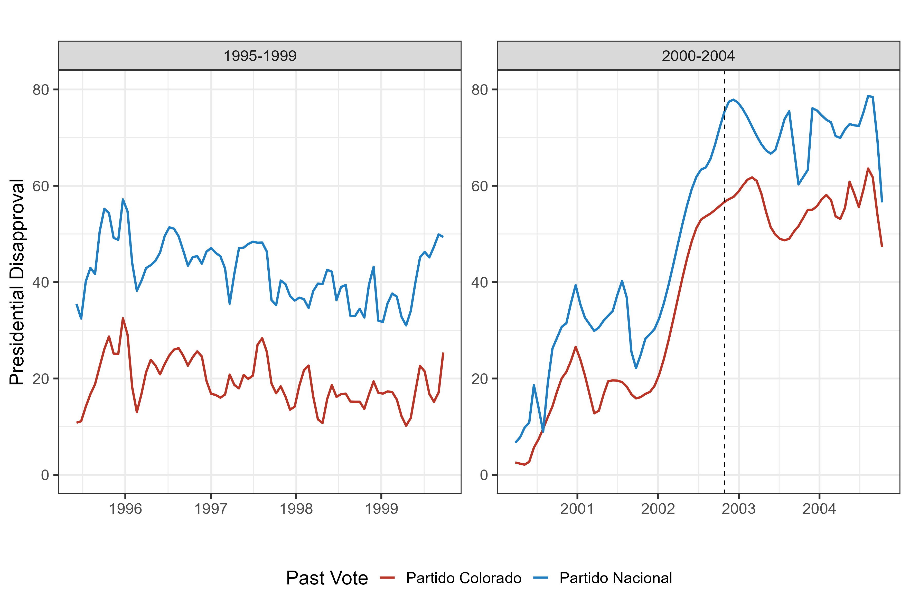
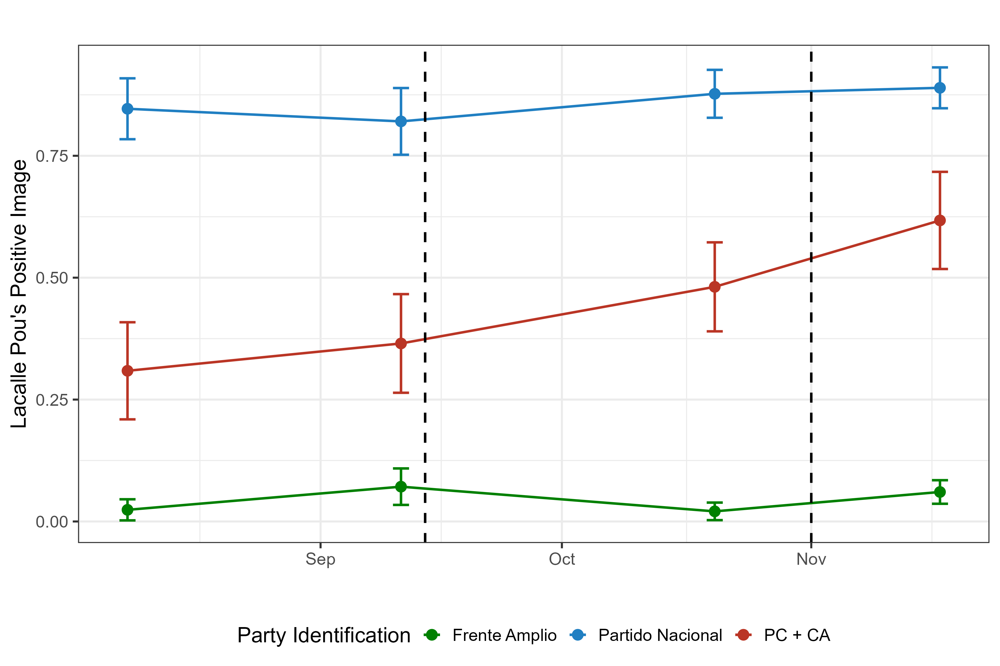
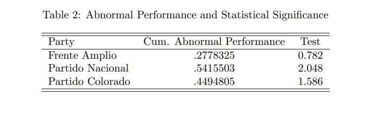
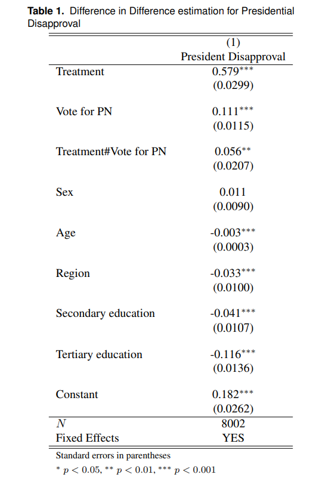

```{r setup, include=FALSE}
library(xaringanthemer)
library(kableExtra)
library(xaringan)
library(xaringanExtra)

style_duo_accent(primary_color = "#001A57",
                 secondary_color = "#708090",
                 text_font_family = "Droid Serif",
                 text_font_url = "https://fonts.googleapis.com/css?family=Droid+Serif:400,700,400italic",
                 header_font_google = google_font("Yanone Kaffeesatz"),
                 text_slide_number_color = "#000000")
knitr::opts_chunk$set(echo = FALSE)
options("kableExtra.html.bsTable" = T)

htmltools::tagList(
  xaringanExtra::use_clipboard(
    button_text = "<i class=\"fa fa-clipboard\"></i>",
    success_text = "<i class=\"fa fa-check\" style=\"color: #90BE6D\"></i>",
    error_text = "<i class=\"fa fa-times-circle\" style=\"color: #F94144\"></i>"
  ),
  rmarkdown::html_dependency_font_awesome()
)
use_xaringan_extra(c("tile_view", "animate_css", "tachyons"))
use_scribble()
use_extra_styles(
  hover_code_line = TRUE,         
  mute_unhighlighted_code = TRUE
  )  

```

# Background

## Coalition Defection in Presidential Systems

--

- Coalitions are a very common form of government in Latin American countries with presidential systems.

--

- Coalition defections occur. Coalitions in Presidential Systems vary in the duration and are affected by president's value in coalition building and participation cost for other parties (Martínez-Gallardo, 2012)


--

- The consequences of coalition arrangements on public opinion have been long studied in parliamentary systems but not quite in presidential systems.

--

- Important differences in the meaning and consequences of coalition defection in presidential vs parliamentary systems. Presidential systems have **fixed terms**

---

# Background

## Coalition Arrangments and Public Opinion

--

- Parties play a crucial role in voters' opinion formation. 

--

- **Party cues** are signals that link a political party to a position on an issue or to an opinion in general, which is shown that influence how citizens form their opinions. 

--

- Coalition formation is a straightforward party action that voters use as a heuristic for updating their perceptions

--

- When party form coalitions (in parliamentary settings) affect perceptions of parties' ideological positions (e.g. Fortunato and Stevenson, 2013), party preferences (e.g. Plescia, 2021) and performance evaluations.

--

- **How does a coalition defection affects public opinion in a fixed-term setting?**

---

# Motivation

- Coalitions and defections are common in presidential systems

--

- Coalition defection could act as a **powerful cue** for citizens

--

- Defection can affect presidential approval given Presidents play a key role in the formation and duration of coalitions in these systems.

--

- Presidential approval in Latin America has meaningful consequences 

--

- **Does coalition defection affect presidential approval?**

---

# Theoretical Expectations

- **Hypothesis 1:** After a coalition defection, there will be a rise in presidential disapproval among partisans of the defecting party. Defection will be a powerful cue for defecting party partisans and they will update their beliefs accordingly. 

--

- **Hypothesis 2:** After a coalition defection, there will be a rise in disapproval among partisans of the defecting party that is significantly higher than the change in disapproval among partisans of the governing party and opposition parties.

---

# Case Study

## Partido Nacional Defection in Uruguay in 2002

- Multi-party presidential system, with 3 main parties.

--

- 1999 election Jorge Batlle center-right Partido Colorado is elected president in the runoff, only 32% vote share, forms coalition with center-right Partido Nacional (22%) 

--

- Minimum Winning Coalitions (Martínez-Gallardo, 2012)

--

- Strongly shared cabinet 6/13 ministers to Partido Nacional.

--

- Strong economic crisis gradually led to defection

--

- Highly debated (no consensus among PN) long-term deterioration in the relationship between PN and Batlle, with defection **after** worst economic moment.

---

# Data and Methods

--

- Individual-level data from 21 nationally representative face-to-face surveys conducted by survey firm Cifra during Batlle's administration (2000-2003)

--

- Part of a larger project which allowed the dissemination of more than 200 Uruguayan public opinion surveys carried out among 1993 and 2020.

--

- Surveys pre and post defection (July 2002 and November 2002) 

--

- Difference-in-differences, events study.

---

# Results

.center[
```{r, out.width = "550px"}

```
]


---


# Results

.center[
```{r, out.width = "550px"}

```
]


---
 
# Results

.center[
```{r, out.width = "700px"}
knitr::include_graphics("figures/aprob_serie_24.png")
```
]

---
 
# Results

.center[
```{r, out.width = "700px"}

```
]

---

# Conclusion

- Theoretical argument: coalition arrangements in Latin America impact public opinion.

--

- Relatively small but significant effect, in line with hypotheses

--

- Weak causal identification assumptions

--

- Possible implications for theories of incentives of defection and governing after a coalitional defection.

--

- Next step: evidence from another case

---
 
# Coalition Formation and Coalition Leader Popularity

.center[
```{r, out.width = "700px"}

```
]

---
class: inverse, center, middle

# Thanks!

### martin.opertti@duke.edu

---

# Event Study

.center[
```{r, out.width = "700px"}

```
]


---

# Differences-in-differences

.center[
```{r, out.width = "300px"}

```
]

---

# Differences-in-differences

.center[
```{r, out.width = "700px"}
knitr::include_graphics("figures/event_study_2.png")
```
]


