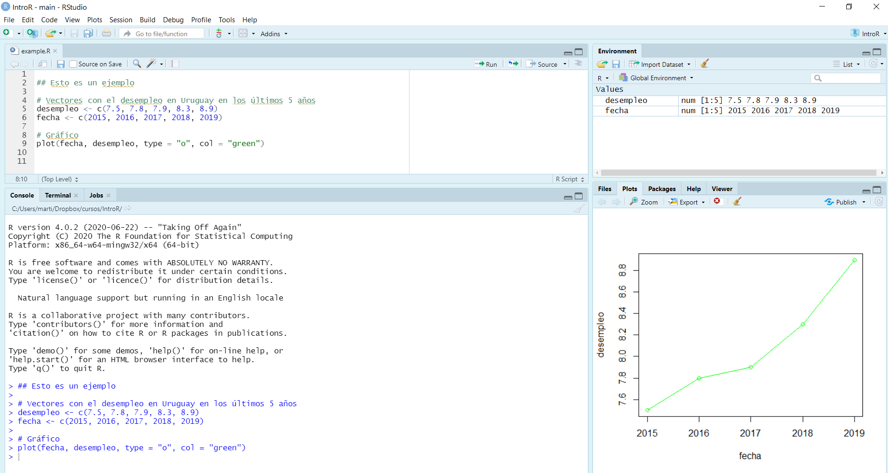
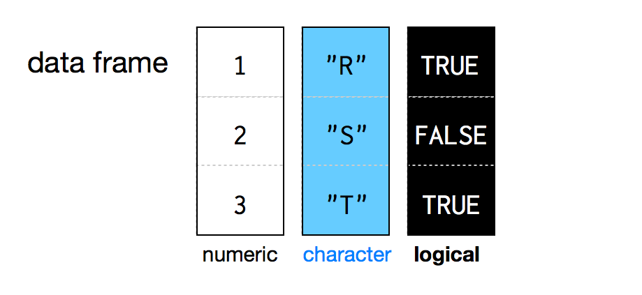
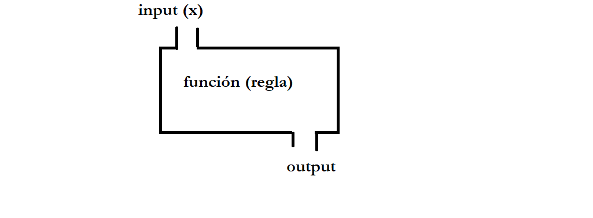

class: inverse, center, middle

```{r setup, include=FALSE}
library(xaringanthemer)
library(kableExtra)
library(xaringan)
library(xaringanExtra)

style_duo_accent(primary_color = "#035AA6",
                 secondary_color = "#507786",
                 text_font_family = "Droid Serif",
                 text_font_url = "https://fonts.googleapis.com/css?family=Droid+Serif:400,700,400italic",
                 header_font_google = google_font("Yanone Kaffeesatz"),
                 text_slide_number_color = "#000000")
knitr::opts_chunk$set(echo = FALSE)
options("kableExtra.html.bsTable" = T)

htmltools::tagList(
  xaringanExtra::use_clipboard(
    button_text = "<i class=\"fa fa-clipboard\"></i>",
    success_text = "<i class=\"fa fa-check\" style=\"color: #90BE6D\"></i>",
    error_text = "<i class=\"fa fa-times-circle\" style=\"color: #F94144\"></i>"
  ),
  rmarkdown::html_dependency_font_awesome()
)
use_xaringan_extra(c("tile_view", "animate_css", "tachyons"))
use_scribble()
use_extra_styles(
  hover_code_line = TRUE,         
  mute_unhighlighted_code = TRUE
  )  
```


# ¿Qué es R?  

---

## R y R Studio

.pull-left[

- R es un software y un lenguaje de programación gratuito enfocado en el análisis estadístico y la visualización de datos.

- R cuenta con gran potencia y flexibilidad, así como una númerosa -y creciente- comunidad de usuarios tanto académicos como profesionales.

.center[
```{r, out.width = "150px"}
knitr::include_graphics("ima/Rlogo.png")
```
]]

.pull-right[
- R Studio es un entorno de desarrollo integrado (IDE) . O en otras palabras... es una interfaz un poco (bastante) más amigable que usar R directamente.

.center[
```{r, out.width = "200px"}

```
]]

---

## Recursos complementarios

La comunidad de usuarios de R es inmensa y muy abierta. Por esto hay muchísimos recursos para aprender de forma independiente y resolver problemas cuando nos estancamos:

- Libro "R for Data Science". Es muy completo y referencia en la mayoría de los cursos de R, pueden acceder a la versión online [original](https://r4ds.had.co.nz/) y a una [traducción](https://r4ds-en-espaniol.netlify.app/)
- [Hands On Programming with R](https://rstudio-education.github.io/hopr/basics.html) es otro libro libre muy útil sobre R  
- [R Bloggers](https://www.r-bloggers.com/) y [rpubs](https://rpubs.com/) publican miles de tutoriales para temas específicos 
- Existen foros -por ej. [Stack Overflow](https://stackoverflow.com/)- donde responden una infinidad preguntas de programación en R. 
- [IntRo](https://github.com/Nicolas-Schmidt/IntRo) es un excelente curso de R (con gran contenido teórico) de FCS-UdelaR a cargo de Nicolás Schmidt 
- [AnalizaR](https://arcruz0.github.io/libroadp/index.html) es un libro sobre análisis de datos en R con énfasis en Ciencia Política 


---
class: inverse, center, middle

# Primeros pasos

---

## Abrimos R Studio 
.center[
```{r, out.width = "1000px"}

```
]
---

## R Studio

- .bold[Source (editor):] es donde creamos y editamos los scripts, es decir, donde escribimos y almacenamos el código.

- .bold[Console (consola):] imprime el código que corremos y la mayoría de los resultados. Podemos escribir código directamente aquí  también, aunque si queremos guardarlo lo recomendable es hacerlo en el script.

- .bold[Environment (ambiente):] Muestra todos los objetos que creaste en cada sesión.

- .bold[Gráficos (y más):] Imprime los gráficos. En el mismo panel figuran otras pestañas como "Help" que sirve para buscar ayuda.

---

## Scripts 

- Es un archivo de texto con el código y anotaciones. 

- Se crea arriba a la izquierda "file/New File/R Script" o `ctrl + shift + n`. 

- Se guarda con `ctrl + s` y es un documento de texto como cualquier otro (word, txt). Esto nos permite reproducir paso a paso todo lo que hicimos durante nuestro análisis.

- Haciendo click luego en el script guardado se inicia R Studio. 

- Para ejecutar una línea de código pueden usar el botón de "Run" arriba a la derecha o -más cómodo- `ctrl + enter`

---

## Ayuda  

- Obtener la ayuda correcta es fundamental al programar en R. Podemos obtener ayuda de todas las funciones que utilizamos con el comando `help()` (ej. `help(mean)`) o `?` (ej. `?mean`)

- Si no podemos solucionar un error con la documentación de las funciones/paquetes muchas veces sirve buscar en un navegador 

- Muchas páginas contienen información relevante para solucionar problemas, entre las que se destaca [stackoverflow](https://stackoverflow.com/questions/tagged/r)

- En caso de no encontrar solución se puede consultar en páginas como stackoverflow mediante un [ejemplo reproducible o reprex](https://stackoverflow.com/questions/5963269/how-to-make-a-great-r-reproducible-example)

---

## Ayuda

```{r ej9bb2_e3, echo = TRUE, eval = FALSE}
help(mean)
```

.center[
```{r, out.width = "1000px"}
knitr::include_graphics("ima/ima_mean.jpeg")
```
]

   
---

## Workspace
- R nos ofrece guardar el ambiente (objetos, funciones, datos, etc.) luego de terminada cada sesión (lo que llama workspace). Si lo guardamos, la próxima vez que abramos ese script, nos encontraremos todo como lo dejamos (existirán los mismos objetos, funciones y datos). 

- Lo recomendado es NO guardar el workspace, y guardar solamente el Script. De esta forma, cuando retomemos nuestro análisis en una nueva sesión de R, podemos correrlo y chequear que efectivamente genere los que querramos.

- Pueden desactivar la pregunta en Tools - Global Options - General - desmarcando la opción "Save workspace into RData" y desmarcando "restore RData into workspace"
      
      
---
class: inverse, center, middle

# Lenguaje básico de R

---

## Anotaciones

- Es importante ser prolijo y cuidadoso con lo que hacemos
- Los scripts nos dan la posibilidad de anotar comentarios, lo que es muy útil:

```{r ej3, echo = TRUE}
## Esta línea es una anotación. 

## R ignora todo lo que está acá adentro (tiene que empezar con #)

## Podemos escribir nombres de funciones u objetos y R no las va a
# interpetar

## Usar anotaciones es clave para poder entender qué fue lo que
# hicimos anteriormente
```

- De esta forma, podemos comentar que fue lo que hicimos para acordarnos nosotros, y que los demás entiendan

---

## R como calculadora 

Para empezar, R sirve como calculadora. Se pueden realizar operaciones matemáticas, por ejemplo:

.codefont[
```{r ej5x, echo = TRUE}
# Operaciones sencillas
2 + 2  
20 - 10
10 / 2
10 * 10
```
]

---

## Objetos en R
En muchos programas estadísticos solemos solamente "imprimir" resultados (lo que llamamos expresiones). En R podemos utilizar este enfoque:

```{r ej5, echo = TRUE}
# Una operación sencilla:
43*47 # Se imprime el resultado
```

Sin embargo, en R también podemos almacenar los resultados en objetos. Creamos los objetos mediante asignaciones (`<-`). En este caso, guardemos el valor (a diferencia de imprimirlo). 

```{r ej5b, echo = TRUE}
year <- 43*47 # Se crea un objeto
```

Si a esto lo ponemos entre paréntesis combinamos ambos enfoques: se guarda el objeto y se imprime el resultado

```{r ej5z, echo = TRUE}
(year <- 43*47) # Se crea un objeto y se imprime
```
---

## Asignaciones 

- El símbolo para crear un objeto es ` <-` (alt + -) y se llama asignador
- Las asignaciones se crean de la siguiente manera: nombre_del_objeto `<-` valor.  
- Como vimos, una vez que creo un objeto, R (por defecto) no imprime su valor. Este se puede obtener escribiendo simplemente el nombre del objeto o mediante la función `print()`:

.codefont[
```{r ej5c, echo = TRUE}
year <- 43*47 # Se crea un objeto

year # Imprime el objeto year

print(year) # Imprime el objeto year
```
]

---

## Algunas funciones básicas

```{r ej5c2, echo = TRUE, eval = FALSE}
ls() # Lista los objetos en el ambiente

rm(year) # Borra objeto del ambiente

rm(list=ls()) # Borra todos los objetos del ambiente

help(ls) # Buscar ayuda sobre una función
```

---
class: inverse, center, middle

# Objetos 

---

## Clases y tipos de objetos

- En R utilizamos constantemente objetos. Cada objeto tiene una clase, tipo y atributos. 

- Esto es importante porque las funciones que podemos aplicar a nuestros datos dependen del objeto en el que los definimos.

- El uso de objetos tiene muchos benificios como extraer parte de ellos para determinados usos, duplicarlos o realizar operaciones sin imprimir en la consola.

---

## Tipos de objetos

El tipo de un objeto refiere a cuál es el tipo de los datos dentro del objeto. Los tipos más comunes son:
 
```{r t1, echo = FALSE, results="hide"}
Nombre <- c("integer", "double", "character", "logical")
Tipos <- c("Númerico: valores enteros", "Númerico: valores reales", "Texto", "Lógico (TRUE or FALSE)")
Ejemplo <- c(10, 10.5, "Diez", TRUE)
tabla1 <- data.frame(cbind(Nombre, Tipos, Ejemplo))
```
 
```{r t1_c, echo = FALSE}
tabla1 %>%
  kbl() %>%
  kable_styling(bootstrap_options = c("striped", "hover", "condensed"), font_size = 20)
```

---

## Clases o estructura de datos

Las clases de objetos son formas de representar datos para usarlos de forma eficiente. Se dividen en cuántas dimensiones tienen y si poseen distintos tipos de datos o no. Las clases de datos más comunes en R son: 

- `vector` (vectores): es la forma más simple, son unidimensionales y de un solo tipo

- `lists` (listas): son unidimensionales pero no están restringidas a un solo tipo de datos

- `matrix` (matrices): tienen dos dimensiones (filas y columnas) y un solo tipo de datos. 

- `dataframes` (marcos de datos): son el tipo de estructura al que más acostumbrado estamos, con dos dimensiones (filas y columnas) y puede incluir distintos tipos de datos (uno por columna). Pueden considerarse como listas de vectores con el mismo tamaño. 


En ocasiones podemos transformar objetos de una clase a otra.


---
## Clases y tipos de objetos

.center[
```{r ej5434, out.width = "800px"}
knitr::include_graphics("ima/sch.jpg")
```
]

.right[ R variables and data types: Introduction to R Programming, Sydney-Informatics
]


---

## Funciones para explorar objetos

R tiene funciones que nos permiten identificar la clase, el tipo, la estructura y los atributos de un objeto.

- `class()` - ¿Qué tipo de objeto es?

- `typeof()` - ¿Qué tipos de data tiene el objeto?

- `length()` - ¿Cuál es su tamaño?

- `attributes()` - ¿Tiene metadatos?


---

## ¿Por qué importan los tipos y clases? 
Supongamos que creamos un objeto con el valor 10, al que luego le sumaremos otro objeto con el valor 20. 

```{r ej7b2, echo = TRUE, error=TRUE}
obj_1 <- "10"

class(obj_1)
obj_1 + 20 # Da error
```

---

## ¿Por qué importan los tipos y clases? 
En cambio, si creamos el objeto de tipo númerico:

```{r ej7b3, echo = TRUE}
obj_1 <- 10

class(obj_1)
obj_1 + 20 # Funciona
```

---

## ¿Por qué importan los tipos y clases? 
Normalmente no trabajamos con objetos de un solo valor, y reescribirlos no es una opción. Para ellos tenemos coercionadores `as.logical()`, `as.integer()`, `as.double()`, o `as.character()`: funciones que transforman un objeto de un tipo a otro. En este caso:
```{r ej7b32, echo = TRUE, error=TRUE}
obj_1 <- "10"

class(obj_1)

obj_1 <- as.numeric(obj_1)
class(obj_1)
is.numeric(obj_1) # Podemos verificarlo directamente también
```

---
class: inverse, center, middle

# Vectores

---

## Vectores 
Un vector es una colección de elementos. Hay 4 tipos de vectores: lógicos, character, integer y double (estos dos últimos son numéricos). Los elementos determinarán el tipo del objeto. Crear un vector es muy sencillo mediante la función `c()`:

```{r ej7b35a, echo = TRUE}
mi_primer_vector <- c(1, 3, 5, 7, 143) 
print(mi_primer_vector)
```


---

## Indexación 
Cuando queremos referirnos a uno o varios elementos dentro de un vector utilizamos `[]` (lo que se llama indexación).
```{r ej7b35b, echo = TRUE}
## Indexación:
mi_primer_vector
mi_primer_vector[1] # El primer elemento dentro del vector 
# Nos sirve por ejemplo para extraer partes del vector:
v3 <- mi_primer_vector[1:3] # Creo nuevo vector con los elementos del 1 al 3
v3
```

---
class: inverse, center, middle

# Dataframes 

---

## Dataframes
- Un dataframe o marco de datos (es lo que nos solemos referir como "base de datos"). 

- Es por lejos la estructura más usada y útil para almacenar y analizar datos

- Formalmente, son la conjunción de dos o más vectores (independientemente de su tipo) en una tabla con dimensiones (Grolemund, 2014)

- Cada vector se transforma en una columna.

- Es una forma de estructurar datos con filas y columnas. Las filas suelen ser las observaciones y las columnas las variables. 

- Cada columna .bold[debe] tener la misma longitud (número de observaciones)

---

## Dataframes
Posible estructura de un dataframe o marco de datos:

.center[
```{r, out.width = "1000px"}

```
]

.right[(Grolemund, 2014)]
---

## Dataframes
Normalmente los dataframes con los que trabajamos los importamos desde otro formato (lo veremos más adelante), pero también podemos crearlos fácilmente en R. 

Supongamos que queremos estructurar los resultados de una encuesta muy corta:

.codefont[
```{r ej8, echo = TRUE, error=TRUE}
# Usamos la función data.frame
encuesta <- data.frame(edad = c(18,24,80,40,76), 
                       ideologia = c("Izquierda", "Izquierda", "Derecha", 
                                     "Centro", "Derecha"),
                       voto = c("Partido A", "Partido A", "Partido C",
                                "Partido B", "Partido B"))
class(encuesta)

encuesta
```
]

---

## Dataframes: indexación
De forma similar a los vectores, la indexación `[]` nos permite acceder a datos dentro de nuestro dataframe. Como los dataframes tienen dos dimensiones (filas y columnas), tenemos que especificar cuáles valores queremos obtener. Para ello la indexación se divide en dos por una coma: antes de la coma nos referimos a las filas, y luego de la coma a las columnas:

.codefont[
```{r ej8_3, echo = TRUE, error=TRUE}
# Valor de fila 1 y columna 1
encuesta[1, 1]
# Valor de toda la columna 1 (no fijamos filas entonces nos devuelve todas)
encuesta[, 1]
 # Valor de toda la fila 1 (no fijamos columnas entonces nos devuelve todas)
encuesta[1, ]
```
]

---

## Dataframes 
Una segunda manera para referirnos a datos dentro un dataframe es el usando el símbolo `$` . Es la manera más utilizada para refernirnos a una columna de un dataframe, y es muy sencillo de utilizar.  

.codefont[
```{r ej8_2, echo = TRUE, error=TRUE}
# Primero escribimos el nombre del dataframe, seguido por el símbolo $ y 
# el nombre de la variable (sin comillas)
encuesta$edad # Esto imprime todos los valores de esa variable
# En un dataframe cada variable es un vector y podemos fijarnos su clase
class(encuesta$edad) 
mean(encuesta$edad) # Podemos aplicarle funciones (la media en este caso)
```
]

---

## Ejercicio

.content-box-blue[
*(1) Crear un vector con la edad de los integrantes de tu hogar*

*(2) Realizar una operación sobre ese vector para calcular la edad de cada integrante en 2030*

*(3) Crear un tercer vector con el nombre de cada uno y combinar los 3 vectores en un dataframe*
]

---

## Ejercicio

.codefontchico[
```{r, echo = TRUE}
# (1) Vector con la edad de los integrantes de tu hogar
edades <- c(26, 27)
edades

# (2) Calcular la edad para 2030
edades_2030 <- edades + 7
edades_2030

# (3) Tercer vector con el nombre de cada uno y crear dataframe
nombres <- c("Martín", "Leticia")
nombres

data.frame(edad_actual = edades,
           edades_2030 = edades_2030,
           nombres = nombres)

```
]

---
class: inverse, center, middle

# Funciones

---

## Funciones 

- Una función es una serie de instrucciones para realizar una tarea específica. La función suele necesitar un imput (generalmente datos) y suele devolver un output (generalmente datos luego de cierta regla)

- Los objetos .bold[son] cosas, las funciones .bold[hacen] cosas

- Por ejemplo, en el caso anterior, usamos la función `mean()` para calcular la media de la variable "edad" del dataframe "encuesta"

- Usar una función es sencillo: escribimos el nombre de la función, seguido de un paréntesis y dentro los datos a los que le queremos aplicar la función. Pueden ser objetos o directamente valores. Ej. `mean(c(10,20,30))` o `mean(objeto)`

- Dentro de la función se especifican los argumentos, que pueden ser dividos en dos tipos. El primero son los datos a los que se le aplica la función y el resto detalles de cómo se computa la función.

---

## Funciones 
.center[
```{r, out.width = "1250px"}

```
]
---

## Funciones (ejemplo) 

```{r ej9bb2, echo = TRUE}
# Supongamos que queremos calcular la media de: 12,24,36,48,60 
(12 + 24 + 36 + 48 + 60)/5 # Calculo directamente la media
data_ej <- c(12, 24, 36, 48, 60) # Genero el vector con los 5 números 
sum(data_ej) / length(data_ej) # Calculo con dos funciones su media
mean(data_ej) # Calculo la media directamente con la función mean()
# También se puede ingresar data directamente en el argumento x
mean(c(12, 24, 36, 48, 60)) 
```

---

## Funciones: R Base

- R viene con un cojunto de [funciones](https://stat.ethz.ch/R-manual/R-devel/library/base/html/00Index.html)  

- Las funciones que vienen "por defecto" son las que escribieron los creadores, al igual que en otros softwares no libres.

- La ventaja de R es que cualquiera puede crear nuevas funciones y publicarlas. Colecciones de funciones (generalmente relacionadas) se llaman "paquetes".

---

## Funciones: argumentos
- Las funciones generalmente cuentan con argumentos que van dentro de los paréntesis.

- La mayoría de las funciones cuentan con el argumento "x" que suele ser el objeto al que le pasaremos la función. Al ser la mayoría de las veces el primer argumento, muchas veces no se explicita: 

```{r ej9bb2_b, echo = TRUE}
media_fun <- mean(data_ej) # Sin explicitar argumento x

media_fun_x <- mean(x = data_ej) # Explicitando argumento x

identical(media_fun, media_fun_x) # El mismo resultado
```

---

## Funciones: argumentos 
- Muchas funciones necesitan más de un argumento para funcionar de forma correcta. 

- Por ejemplo, pensemos en la función `identical()`: "The safe and reliable way to test two objects for being exactly equal. It returns `TRUE` in this case, `FALSE` in every other case.".

- Por definición, `identical()` necesita dos conjuntos de datos distintos, para testear si son iguales.

- En la documentación `help(identical)` podemos ver que cuenta no solo con el argumento x, sino que también con y. 

.codefont[
```{r ej9bb2_c, echo = TRUE}
# Dos maneras de aplicar la función
identical(media_fun, media_fun_x) # por posición
identical(x = media_fun, y = media_fun_x) # por especificación
```
]
---

## Funciones: argumentos 

- A su vez, las funciones muchas veces cuentan con otros argumentos aparte de los datos que usan de insumo. Son detalles de cómo queremos aplicar la regla o el output que recibimos. 

- Volvamos a la función `mean()`. Voy a crear un dataframe con la posición que obtuvo Uruguay en los últimos 5 mundiales de futbol masculino

.codefont[
```{r ej9bb2_d, echo = TRUE}
# Dataframe con el resultado de Uruguuay en los últimos 5 mundiales
uru_mundial <- data.frame(year = c(2002, 2006, 2010, 2014, 2018),
                          posicion = c(26, NA, 4, 12, 5))
# Veamos la posición promedio:
mean(uru_mundial$posicion) 
# Como tenemos un dato perdido, la función nos devuelve NA

# Si especificamos el argumento na.rm (no tener en cuenta los datos perdidos):
mean(uru_mundial$posicion, na.rm = TRUE)

```
]
---

## Funciones: argumentos por defecto

- Es importante entender que la función `mean()` <b> por defecto </b> tiene el argumento `na.rm = FALSE`. De esta forma, si nosotros solamente le pasamos el argumento x, no quitará los datos perdidos. 

- Leer la documentación de las funciones es fundamental, y sobretodo prestar atención a los argumentos por defecto.

---

## Funciones: argumentos 

```{r ej9bb2_e, echo = TRUE, eval = FALSE}
help(mean)
```

.center[
```{r, out.width = "1000px"}
knitr::include_graphics("ima/ima_mean.jpeg")
```
]


