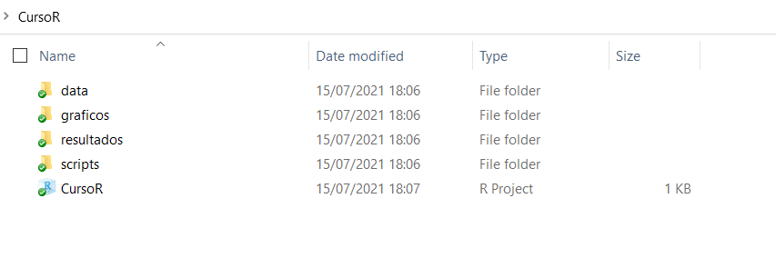

class: inverse, center, middle

```{r setup, include=FALSE}
library(xaringanthemer)
library(kableExtra)
library(xaringan)
library(tidyverse)
library(data.table)
library(xaringanExtra)

style_duo_accent(primary_color = "#035AA6",
                 secondary_color = "#507786",
                 text_font_family = "Droid Serif",
                 text_font_url = "https://fonts.googleapis.com/css?family=Droid+Serif:400,700,400italic",
                 header_font_google = google_font("Yanone Kaffeesatz"),
                 text_slide_number_color = "#000000")
knitr::opts_chunk$set(echo = FALSE)
options("kableExtra.html.bsTable" = T)

htmltools::tagList(
  xaringanExtra::use_clipboard(
    button_text = "<i class=\"fa fa-clipboard\"></i>",
    success_text = "<i class=\"fa fa-check\" style=\"color: #90BE6D\"></i>",
    error_text = "<i class=\"fa fa-times-circle\" style=\"color: #F94144\"></i>"
  ),
  rmarkdown::html_dependency_font_awesome()
)
xaringanExtra::use_xaringan_extra(c("tile_view", "animate_css", "tachyons"))
xaringanExtra::use_scribble()
use_extra_styles(
  hover_code_line = TRUE,         
  mute_unhighlighted_code = TRUE
  )  
```

# Directorios de trabajo y proyectos de R (.Rproj)

---

## Directorios de trabajo 
- Para abrir en R un archivo guardado en tu computadora, debes especificar en qué carpeta está guardado, para esto hay varias opciones. Primero, puedes fijar un directorio por defecto:

.codefont[
```{r ej4, echo = TRUE, results = "hide", error=TRUE, eval = FALSE}
# Puedo fijar el directorio de trabajo con la función setwd()
# Fijar la carpeta donde vamos a importar y exportar los archivos:
setwd("micompu/micarpeta") 
getwd() # Con está función puedo consultar el directorio
```
]

.codefont[
```{r ej5, echo = TRUE, error=TRUE}
# Ahora, si quiero leer un archivo que esté en "micompu/micarpeta" simplemente 
# escribo su nombre dentro de la función, en el lugar del "path".

# Supongamos que tengo dentro de la carpeta "micarpeta" un excel con datos
# de desempleo en Uruguay:

library(readxl)
desempleo_uru <- read_excel("data/desempleo.xlsx")
head(desempleo_uru, 4)
```
]
---

## Directorios de trabajo 
También podemos no fijar un directorio para la sesión e ir especificando los directorios completos dentro de cada función:

```{r ej6, echo = TRUE, error=TRUE, results = "hide", eval = FALSE}
desempleo_uru <- read_excel("micompu/micarpeta/data/desempleo.xlsx")
```

---

## Proyectos de R (.Rproj)

- La mejor práctica para que nuestros scripts sean portables y reproducibles, es utilzar R Projects (`.Rproj`). 

- Para crear un `.Rproj` vamos a `File/New Project` y ahí nos encontramos con la opción de crear una carpeta para guardar los archivos o utilizar una carpeta ya existente.

- Al crear un proyecto de R se creará un archivo de extensión `.Rproj`, cuando le damos click se inicia una nueva sesión de R cuyo directorio es por defecto la carpeta en la que está guardado. 

- Podemos usar directorios relativos dentro de la carpeta en la que se aloja nuestro `.Rproj` para importar y exportar datos a y desde R. Esto hace que uno pueda cambiar la carpeta o compartirla y el script correrá de igual manera (a diferencia de si utilizamos `setwd()`)

---

## Proyectos de R (.Rproj) 
<ol>
<li> Creen una carpeta para guardar el material del curso 
<li> Descarga la carpeta "Data" y los scripts del módulo 1 y 2. Pegalas en la carpeta del punto 1 (guarda todos los scripts dentro de la misma carpeta)
<li> Crea además dos carpetas más dentro de tu carpeta: "graficos" y "resultados"
<li> Abran RStudio y desde ahí creen un `.Rproj`, desde existing directory, seleccionando la carpeta del punto 1
</ol>

.center[
```{r ej7, out.width = "700px"}
knitr::include_graphics("ima/rproj.png")
```
]
---

## Proyectos de R (.Rproj) 
<ol start=5>
<li> Deberían ver en su carpeta algo así:
</ol>

.center[
```{r ej7_b, out.width = "1000px"}

```
]

---

## Proyectos de R (.Rproj)
<ol start=6>
<li> Abran el archivo `.Rproj` y desde ahí usando File/Open File abren los scripts dentro de la carpeta "scripts". Es importante que los abran desde la sesión que inicia el proyecto y no directamente haciendo click en el script.

<li> Ya estamos listos para empezar!
</ol>

---
class: inverse, center, middle

# Importar y exportar datos

---

## Importar datos
- Hasta ahora trabajamos principalmente con datos ingresados manualmente con las funciones `c()` y `data.frame()`

- Normalmente cuando trabajamos con datos solemos utilizar datos ya creados guardados en los formatos de otros programas (ej. Excel, Stata, SPSS) 

- Existen varios paquetes que permiten importar y exportar datos desde distintos formatos. Algunos de los más utilizados son [readr](https://readr.tidyverse.org/), [haven](https://haven.tidyverse.org/), [readxl](https://readxl.tidyverse.org/) y [utils](https://www.rdocumentation.org/packages/utils/versions/3.6.2)

---

## Importar datos 
Distintas funciones nos sirven para importar datos a R desde distintos formatos. Veamos algunos ejemplos:

.codefont[
```{r ej8, echo = TRUE, results="hide", message=FALSE, warning=FALSE}
# Con la función read_csv() del paquete readr importamos archivos .csv
library(tidyverse)
gapminder_csv <- read_csv("data/gapminder.csv")

# Con la función read_excel() del paquete readxl importamos archivos excel
library(readxl)
gapminder_excel <- read_excel("data/gapminder.xlsx")

```
]

.codefont[
```{r ej8_b, echo = TRUE}
# Vemos que los dataframes son iguales, tienen la mismas filas y columnas
dim(gapminder_csv)
dim(gapminder_excel)
```
]
---

## Importar datos
Algunos paquetes incluyen datos, por ejemplo, gapminder. En la documentación del paquete se encuentra el nombre de los datos. Con una simple asignación los podemos cargar 
```{r ej9, echo = TRUE, message=FALSE, warning=FALSE}
library(gapminder)

data_gapminder <- gapminder
head(data_gapminder)
```

---

## Importar datos
También es posible importar datos guardados en los formatos de otros softwares estadísticos como SPSS o Stata. Para esto usaremos el paquete haven.

.codefont[
```{r ej10, echo = TRUE}
library(haven)

# SPSS
gapminder_spss <- read_spss("data/gapminder.sav") 

# STATA
gapminder_stata <- read_stata("data/gapminder.dta") 
```
]

O podríamos llamar a la función y paquete dado que generalmente solo utilizamos una función de los paquetes que cargan datos (depende del caso obviamente)

.codefont[
```{r ej10bb, echo = TRUE}
# SPSS
gapminder_spss <- haven::read_spss("data/gapminder.sav") 

# STATA
gapminder_stata <- haven::read_stata("data/gapminder.dta") 
```
]

---

## Importar datos 
R también cuenta con sus propios formatos de almacenamiento de datos (`.rds` y `.Rdata` o `.rda`). Este enfoque es poco práctico si queremos usar los datos almacenados en otro programa, pero muy útil si solamente usaremos R dado que mantiene la información tal cual estaba en R (por ej. tipos de variables o atributos):

.codefont[
```{r ej11, echo = TRUE}
# Para esto no necesitamos cargar paquetes. 
# Guardar un objeto como .rds:
saveRDS(object = data_gapminder,
        file = "resultados/data_gapminder.rds") 

 # Leemos un archivo .rds
miobjeto_rds <- readRDS(file = "resultados/data_gapminder.rds")

# Con .rda se pueden guardar varios objetos al mismo tiempo!
# Exportamos un archivo .Rdata
save(data_gapminder, miobjeto_rds,
     file = "resultados/dos_dataframes.Rdata") 

 # Importamos un archivo .Rdata
load("resultados/dos_dataframes.Rdata")
```
]

---

## Exportar datos 
- También podemos guardar archivos desde R en otros formatos. 
- Con [readr](https://readr.tidyverse.org/) podemos exportar archivos en formato .csv 
- Con [writexl](https://cran.r-project.org/web/packages/writexl/writexl.pdf) podemos exportar directamente un excel.
- Con [haven](https://www.rdocumentation.org/packages/haven/versions/2.3.1) podemos exportar achivos en formato .dta (Stata) y .sav (SPSS)

.codefont[
```{r ej12, echo = TRUE}
# Guardar .csv
data_gapminder <- gapminder
write_excel_csv(data_gapminder, "resultados/gapminder.csv")

# Guardar excel
library(writexl)
write_xlsx(data_gapminder, "resultados/gapminder.xlsx")

# Guardar .dta (Stata)
library(haven)
write_dta(data_gapminder, "resultados/gapminder.dta")

# Guardar .sav (SPSS)
write_sav(data_gapminder, "resultados/gapminder.sav")

# Guardar .sas (SAS)
write_sas(data_gapminder, "resultados/gapminder.sas")
```
]

---

## Importar y exportar datos: factores

- Otro tipo de variables en R son los factores (factors), utilizados para representar data categórica. Estos suelen confundirse con las variables de caracteres pero tienen algunas diferencias. 

- Normalmente los factores son utilizados para las variables de caracteres con un número de valores posibles fijo y cierto orden (opcional)

- A R le gusta transformar las variables de caracteres en factores al importarlas (si usamos R Base particularmente).

- El paquete [forcats](https://forcats.tidyverse.org/) (dentro del Tidyverse) ayuda a manejar variables de caracteres y factores:
    - `fct_relevel()` cambia manualmente el orden de los niveles
    - `fct_reoder()` cambia el orden de los niveles de acuerdo a otra variable
    - `fct_infreq()` reordena un factor por la frecuencia de sus valores 
    - `fct_lump()` collapsa los valores menos frecuentes en otra categoría "other". Es muy útil para preparar datos para tablas y gráficos

---

## Importar y exportar datos: factores 

.codefontchico[
```{r ej13, echo = TRUE}
# Podemos chequear y coercionar factores
data_gapminder <- gapminder
is.factor(data_gapminder$continent) # Chequeo si es factor
levels(data_gapminder$continent) # Chequeo los niveles
# Transformo a caracter
data_gapminder$continent <- as.character(data_gapminder$continent) 
class(data_gapminder$continent)
# De vuelta a factor
data_gapminder$continent <- as.factor(data_gapminder$continent)
class(data_gapminder$continent)
```
]

---

## Importar y exportar datos: factores 

.codefont[
```{r ej14, echo = TRUE}
# Para crear un factor usamos la función factor()
paises_mercosur <- factor(c("Argentina", "Brasil", "Paraguay", "Uruguay"))
table(paises_mercosur)
# La función fct_relevel() nos permite reordenar los niveles del factor
paises_mercosur <- fct_relevel(paises_mercosur, "Uruguay")
table(paises_mercosur)
```
]

---
class: inverse, center, middle

# Explorar datos

---

## Resumen de un dataframe

.codefont[
```{r ej18, eval = FALSE}
# R tiene un visor para datos. Pueden dar click en el dataframe en el ambiente o:
view(data_gapminder)
```
]

.codefont[
```{r ej18b, echo = TRUE}
dim(data_gapminder) # Número de filas y columnas
names(data_gapminder) # Nombre de variables
head(data_gapminder, 3) # Imprime primeras filas (3 en este caso)
```
]

---

## Resumen de un dataframe 

Una de las funciones más utiles para resumir un dataframe es `glimpse()` del paquete dplyr o tidyverse. Es particularmente util debido a que permite un vistazo al nombre, tipo y primeros valores de .bold[todos] las variables de un dataframe.

```{r ej19bc, echo = TRUE}
# Resumen más completo:
glimpse(gapminder) 
```

---
## Tablas

En R Base la función para obtener frecuencias es `table()` junto con `prop.table()` y `addmargins()`

.codefontchico[
```{r ej19b_2, echo = TRUE}
# Para obtener una tabla de frecuencias de una variable usamos la función
# table() de R Base
tabla_1 <- table(data_gapminder$continent) # Frecuencia simple
tabla_1 

prop.table(tabla_1) # Proporciones

addmargins(tabla_1) # Totales

addmargins(prop.table(tabla_1)) # Proporciones y totales
```
]

---
## Tablas 

Para obtener tablas que cruzen dos variables podemos nuevamente usar `table()` especificando dos variables.


```{r ej19b_3, echo = FALSE}
data_gapminder$mercosur <- ifelse(data_gapminder$country == "Uruguay", 1,
                                  ifelse(data_gapminder$country == "Argentina", 1,
                                         ifelse(data_gapminder$country == "Paraguay", 1,
                                                ifelse(data_gapminder$country == "Brazil", 1,
                                                       0))))
```

.codefont[
```{r ej19b_4, echo = TRUE}
tabla_2 <- table(data_gapminder$continent, data_gapminder$mercosur)
tabla_2

prop.table(tabla_2)
```
]


---
class: inverse, center, middle

# Estadística descriptiva

---

## Medidas de tendencia central 

.codefont[
```{r ej20, echo = TRUE}
mean(data_gapminder$lifeExp) # Media
median(data_gapminder$lifeExp) # Mediana
sd(data_gapminder$lifeExp) # Desvío estandar
```
]

---

## Rangos 

```{r ej21, echo = TRUE}
range(data_gapminder$lifeExp) # Rango
max(data_gapminder$lifeExp)
min(data_gapminder$lifeExp)
```

---

## Histogramas 
También podemos graficar los datos rápidamente. Por ejemplo, un histograma:

.center[
.codefont[
```{r ej22, echo = TRUE,  out.width = '400px'}
hist(data_gapminder$lifeExp,
     main = "Distribución de expectativa de vida (Gapminder)")
```
]
]
---

## Gráfico de dispersión (scatterplot) 

.center[
```{r ej22_b, echo = TRUE,  out.width = '400px'}
plot(data_gapminder$lifeExp, data_gapminder$gdpPercap,
     main = "Relación entre expectativa de vida y PBI per cápita")
```
]

---

## Cuantiles
.codefont[
```{r ej23, echo = TRUE}
quantile(data_gapminder$lifeExp, probs=c(0.2, 0.4, 0.8)) # Cuantiles
quantile(data_gapminder$lifeExp, probs=seq(0, 1, 0.2)) # Cuantiles

# Con la función ntile() de dplyr podemos asignar quintiles en una variable
data_gapminder$lifeExp_quant <- ntile(data_gapminder$lifeExp, 5)

# Tabla cruzada 
table(data_gapminder$continent, data_gapminder$lifeExp_quant)
```
]

---
class: inverse, center, middle

# Crear y recodificar variables 

---

## Crear variables con mutate() 
El paquete [dplyr](https://cran.r-project.org/web/packages/dplyr/dplyr.pdf) contiene la función [`mutate()`](https://www.rdocumentation.org/packages/dplyr/versions/0.5.0/topics/mutate) para crear nuevas variables. `mutate()` crea variables al final del dataframe.

.codefont[
```{r ej25, echo = TRUE}
data_gapminder <- as_tibble(gapminder) # Pasamos nuevamente a tibble

# Variable de caracteres
data_gapminder <- mutate(data_gapminder, var1 = "Valor fijo") 

# Variable numérica
data_gapminder <- mutate(data_gapminder, var2 = 7) 
head(data_gapminder, 3)

## Podemos escribir lo mismo de distinta manera:
data_gapminder <- mutate(data_gapminder, var1 = "Valor fijo",
                                         var2 = 7)
```
]

---

## Recodificar una misma variable 
.codefont[
```{r ej25_C, echo = TRUE}
## También tenemos dos maneras de recodificar una misma variable
# Con dplyr
data_uru <- filter(gapminder, country == "Uruguay")
data_uru <- mutate(data_uru, country =  "ROU")
head(data_uru, 3)
# En R Base
data_uru <- filter(gapminder, country == "Uruguay")
data_uru$country <- "ROU"
head(data_uru, 3)
```
]

---

## Recodificar variables con mutate() 
.codefont[
Con `mutate()` también podemos realizar operaciones sobre variables ya existentes:
```{r ej26, echo = TRUE}
## Podemos recodificar usando variables y operadores aritméticos
# Calculemos el pbi total (pbi per capita * población)
d_gap <- mutate(gapminder, gdp = gdpPercap * pop)
head(d_gap, 3)
# Podemos calcular el logaritmo 
d_gap <- mutate(d_gap, gdp_log = log(gdp))
head(d_gap, 2)
```
]

---

## Adelantar y retrasar variables 

.codefont[
```{r ej27, echo = TRUE}
## Podemos retrasar -lag()- o adelantar -lead()- variables
# Primero nos quedamos con los datos de Uruguay
# Atrasamos un período el pbi per capita
data_uru <- filter(gapminder, country == "Uruguay") 
data_uru <- mutate(data_uru, gdpPercap_lag = lag(gdpPercap, n=1))
head(data_uru, 4)
# Adelantamos dos períodos el pbi per cápita 
data_uru <- mutate(data_uru, gdpPercap_lead2 = lead(gdpPercap, n=2))
head(data_uru, 4)
```
]

---

## Rankings e identificadores 

.codefont[
```{r ej28, echo = TRUE}
 # Identificador (números consecutivos)
d_gap <- mutate(gapminder, id = row_number())
head(d_gap, 4)

# Ranking según variable
d_gap <- mutate(d_gap, gdp_rank = row_number(gdpPercap)) 

# Ordeno los datos según el ranking
d_gap <- arrange(d_gap, desc(gdp_rank)) 
head(d_gap, 4)
```
]

---

## Transformaciones de tipo 

Al igual que hacíamos con los vectores, podemos tranformar el tipo de una variable 

```{r ej2bcsb, echo = FALSE}
d_gap <- select(gapminder, continent, year, lifeExp)
```

.codefont[
```{r ej28bb, echo = TRUE}
# Exploro tipo de variables
glimpse(d_gap)

# Variable continente a caracteres y año a factor
d_gap <- d_gap %>% 
  mutate(continent = as.character(continent),
         year = as.factor(year))

glimpse(d_gap)
```
]

---

## Transformaciones de tipo 

.codefont[
```{r ej28bbd, echo = TRUE}
# Variable año a numérica nuevamente
d_gap <- d_gap %>% 
  mutate(year = as.numeric(year))

glimpse(d_gap)
```
]

```{r ej2sdsdbcsb, echo = FALSE}
d_gap <- gapminder
```


---
class: inverse, center, middle

# Recodificaciones condicionales

---

## Recodificaciones condicionales
- Muchas veces transformar los datos implica recodificar una variable de forma condicional, esto es, asignar distintos valores en función de los valores de una o más variables.

- Para esto utilizaremos las funciones [ifelse()](https://www.rdocumentation.org/packages/base/versions/3.6.2/topics/ifelse) (R Base), [mutate()](https://www.rdocumentation.org/packages/dplyr/versions/0.5.0/topics/mutate), [recode()](https://www.rdocumentation.org/packages/dplyr/versions/0.7.8/topics/recode) y [case_when()](https://dplyr.tidyverse.org/reference/case_when.html) (Tidyverse)

---

## Recodificación condicional con case_when y mutate

`recode()` es muy útil para cuando queremos recodificar los valores de una variable de forma puntual, pero no me permite operaciones más complejas como crear una variable condicional basada en dos variables distintas. Para ello dplyr tiene la función `case_when()`. Esencialmente, con `ifelse()` (R Base) podemos lograr lo mismo que con `case_when()` (Tidyverse). `case_when()` puede resultar más sencilla de utilizar al no haber necesidad de anidar la función cuando establecemos múltiples condiciones. 

Cuando trabajmos con dataframes `case_when()` se utiliza dentro de `mutate()`. `case_when()` testea condiciones en orden (esto es importante cuando pasamos condiciones no excluyentes). `case_when()` lista condiciones para las que asigna un valor en caso de que sean verdaderas, y permite pasar múltiples condiciones. `TRUE` refiere a las condiciones no listadas. La estructura de `case_when()` es: 


```{r ej28m, eval = FALSE,  echo = TRUE}
mutate(data, 
       var_nueva = case_when(var_original == "Valor 1" ~ "Valor A",
                             var_original == "Valor 2" ~ "Valor B",
                             TRUE ~ "Otros"))
```


---
## Recodificación condicional con case_when y mutate


```{r ej28c_2, echo = TRUE}
# Creemos una variable que indique si el país es Uruguay o no
d_gap <- mutate(d_gap, uruono = case_when(
  country == "Uruguay" ~ "Si",
  TRUE ~ "No")
)

table(d_gap$uruono)
```


---
## Recodificación condicional con case_when y mutate

Podemos establecer varias condiciones fácilmente:

.codefont[
```{r ej28n2, echo = TRUE}
d_gap <- gapminder

d_gap <- mutate(d_gap, mercosur = case_when(country == "Uruguay" ~ 1,
                                            country == "Argentina" ~ 1,
                                            country == "Paraguay" ~ 1,
                                            country == "Brazil" ~ 1, 
                                            TRUE ~ 0))

table(d_gap$mercosur)
```
]


---
## Recodificación condicional con case_when y mutate

También podríamos usar operadores para simplificar esto:

.codefont[
```{r ej28f3, echo = TRUE}
d_gap <- mutate(d_gap, mercosur = case_when(
  country %in% c("Argentina", "Paraguay", "Brazil", "Uruguay") ~ 1,
  TRUE ~ 0)
  ) 

d_gap <- mutate(d_gap, mercosur2 = case_when(
  country == "Argentina" | country == "Paraguay" | 
    country == "Brazil" | country == "Uruguay" ~ 1,
  TRUE ~ 0)
  )

identical(d_gap$mercosur, d_gap$mercosur2)
```
]

---

## Recodificación condicional con case_when y mutate

`case_when()` sirve también para recodificar una variable con condiciones basadas en múltiples variables.

Supongamos que queremos una variable que indique los países-año con expectativa de vida mayor a 75 o pbi per cápita mayor a 20.000

.codefont[
```{r ej28o, echo = TRUE}
d_gap <- mutate(d_gap, 
                var1 = case_when(gdpPercap > 20000 ~ 1,
                                 lifeExp > 75 ~ 1,
                                 TRUE ~ 0))
table(d_gap$var1)
```
]
---

## Recodificación condicional con ifelse

Para recodificar condicionalmente una variable en R base podemos usar la función `ifelse()`. Esta función tiene tres argumentos: 
- `test`: primero establece una condición a probar
- `x`: el valor para los valores en donde `test = TRUE`
- `y`: el valor para los valores en donde `test = FALSE`

Supongamos que queremos crear una variable en la data de gapminder queremos crear una nueva variable `poburu` donde 1 represente los países con más de 3 millones de habitantes y 0 represente a los países con menos de 3 millones de habitantes

.codefont[
```{r ej28b, echo = TRUE}
# Usualmente no explicitamos los argumentos, los definimos por su orden,
# condición, valor si condición es verdadera y valor si condicion es falsa
d_gap$poburu <- ifelse(d_gap$pop > 3000000, 1, 0)

table(d_gap$poburu)
```
]

---
## Recodificación condicional con ifelse

Para chequear varias condiciones al mismo tiempo  podemos usar `ifelse()` de forma anidada.

.codefont[
```{r ej28e, echo = TRUE}
d_gap$mercosur <- ifelse(d_gap$country == "Uruguay", 1,
                         ifelse(d_gap$country == "Argentina", 1,
                                ifelse(d_gap$country == "Paraguay", 1,
                                       ifelse(d_gap$country == "Brazil", 1,
                                              0))))
table(d_gap$continent, d_gap$mercosur)
```
]

---
## Recodificación condicional con ifelse y mutate

`ifelse()` y `case_when()` pueden cumplir la misma función, aunque para esta última no es necesario anidar.

.codefont[
```{r ej28n, echo = TRUE}
d_gap <- gapminder

## Con ifelse()
d_gap$mercosur <- ifelse(d_gap$country == "Uruguay", 1,
                        ifelse(d_gap$country == "Argentina", 1,
                               ifelse(d_gap$country == "Paraguay", 1,
                                      ifelse(d_gap$country == "Brazil", 1,
                                             0))))

## Con case_when()
d_gap <- mutate(d_gap,
                mercosur_2 = case_when(country == "Uruguay" ~ 1,
                                       country == "Argentina" ~ 1,
                                       country == "Paraguay" ~ 1,
                                       country == "Brazil" ~ 1,
                                       TRUE ~ 0))

identical(d_gap$mercosur, d_gap$mercosur_2)

```
]


