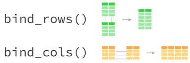
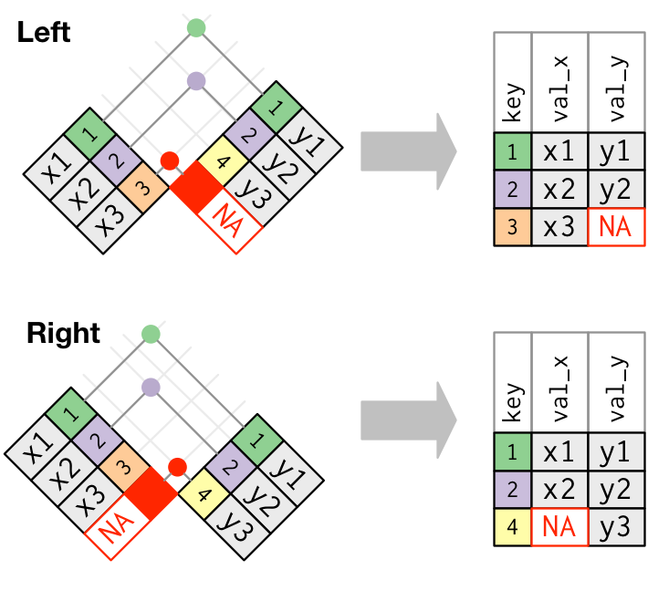
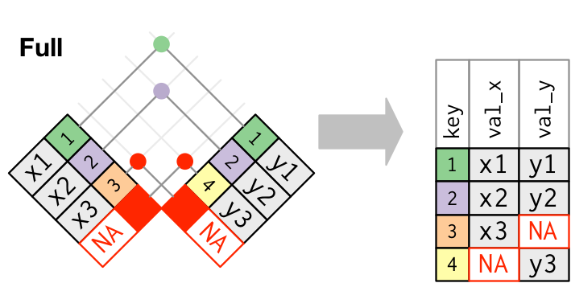
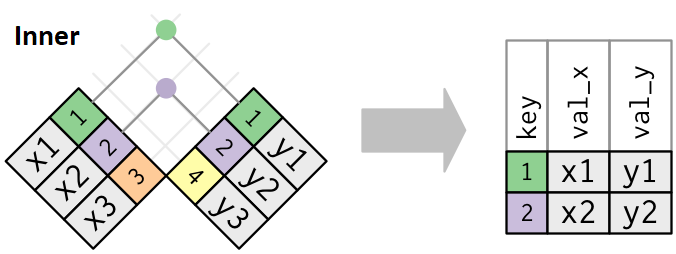

class: inverse, center, middle

```{r setup, include=FALSE}
library(xaringanthemer)
library(kableExtra)
library(xaringan)
library(tidyverse)
library(data.table)
library(gapminder)
library(xaringanExtra)

style_duo_accent(primary_color = "#035AA6",
                 secondary_color = "#507786",
                 text_font_family = "Droid Serif",
                 text_font_url = "https://fonts.googleapis.com/css?family=Droid+Serif:400,700,400italic",
                 header_font_google = google_font("Yanone Kaffeesatz"),
                 text_slide_number_color = "#000000")
knitr::opts_chunk$set(echo = FALSE)
options("kableExtra.html.bsTable" = T)

htmltools::tagList(
  xaringanExtra::use_clipboard(
    button_text = "<i class=\"fa fa-clipboard\"></i>",
    success_text = "<i class=\"fa fa-check\" style=\"color: #90BE6D\"></i>",
    error_text = "<i class=\"fa fa-times-circle\" style=\"color: #F94144\"></i>"
  ),
  rmarkdown::html_dependency_font_awesome()
)
xaringanExtra::use_xaringan_extra(c("tile_view", "animate_css", "tachyons"))
xaringanExtra::use_scribble()
use_extra_styles(
  hover_code_line = TRUE,         
  mute_unhighlighted_code = TRUE
  )  
```

# Repaso explorar datos

---

## Data de la nba
- Vamos a trabajar con un dataframe que contiene los resultados de todos los partidos jugados por equipos de la NBA en las últimas temporadas. Por un detalle de qué es cada variable, ver el siguiente [enlace](https://www.kaggle.com/nathanlauga/nba-games)

- Cada observación (fila) es un partido

- Las variables incluyen nombre del equipo local y visitante, los puntos que anotó cada equipo y otros datos del partido como las asistencias y los rebotes que obtuvo cada equipo.

.center[
```{r, out.width = "300px"}
knitr::include_graphics("ima/nba.png")
```
]

---
## Data de la nba
Ahora importemos y exploremos el dataframe como hicimos la clase anterior:


.codefont[
```{r ch0, echo = TRUE, results = "hide", message = FALSE}
# Importo desde .csv
nba_data <- read_csv("data/nba_data.csv") %>% 
  janitor::clean_names()
```
]

.codefontchico[
```{r ch0b, echo = TRUE}
glimpse(nba_data)
```
]

---
class: inverse, center, middle

# Transformar datos

---
## Transformar datos con dplyr

El paquete dplyr contiene funciones muy útiles para la transformación de dataframes (tibbles). Todas las funciones tienen en común que su primer argumento es un dataframe y que devuelven un dataframe. Algunas de las funciones que vamos a ver:

- `filter()`: filtrar observaciones en base a valores
- `select()`: filtrar variables 
- `mutate()`: crear o recodificar variables
- `summarise()`: colapsa valores según alguna fórmula (sumar, número de casos, media, etc.)
- `arrange()`: ordena los valores según variables
- `group_by()`: define grupos de valores utilizar las otras funciones

---
## Filtrar
Una de las tareas más comunes en el análisis de datos es filtrar observaciones en base a condiciones. Existen muchas maneras de filtrar datos en R, la función `filter()` de dplyr es una de las más sencillas de utilizar. El primer argumento es el dataframe y el segundo la condición por la que queremos filtrar.

.codefont[
```{r ch1, echo = TRUE}
# Tenemos datos de muchas temporadas:
table(nba_data$season)

# Filtremos para quedarnos con la temporada 2018 solamente
nba_data_19 <- filter(nba_data, season == 2019)
table(nba_data_19$season)
```
]

---
## Filtrar

Utilizando operadores lógicos podemos filtrar de formas más complejas:

```{r ch2b, echo = TRUE}
# Todas las temporadas menos la 2020
nba_data_03_19 <- filter(nba_data, season != 2020)
table(nba_data_03_19$season)

# Solo las temporadas 2005, 2010, 2012 y 2017
temporadas <- c(2005, 2010, 2012, 2017)
nba_data_temp <- filter(nba_data, season %in% temporadas)

table(nba_data_temp$season)
```


---
## Filtrar (NA)
También podemos usar las funciones que identifican datos perdidos:

```{r ch2c, echo = TRUE}
# No tenemos datos de rebotes para algunos partidos...

# Para extraer los casos con datos perdidos en la variable reb_HOME
data_incompleta <- filter(nba_data, is.na(reb_home)) 
dim(data_incompleta)
# Para extraer con los casos que tienen datos en reb_home
data_completa_reb <- filter(nba_data, !is.na(reb_home))
dim(data_completa_reb)

```

---
## Seleccionar variables
Con `select()` podemos seleccionar las variables (columnas) que queremos mantener en un dataframe. Podemos nombrarlas, seleccionar cuáles queremos eliminar y referirnos por su orden:

```{r ch4, results = "hide", echo = TRUE}
# Selccionar un conjunto de variables
select(nba_data, pts_home, pts_away)

# Selccionar todas las variables menos las especificadas
select(nba_data, -pts_home)

# Seleccionar un rango de variables según orden
select(nba_data, game_date_est:visitor_team_id)
select(nba_data, 1:10) # Orden numérico
```

---
## Seleccionar variables

El paquete dplyr también contiene un conjunto de [helpers](https://dplyr.tidyverse.org/reference/select.html) para seleccionar variables de forma efectiva por su posición o patrones de texto:

- `starts_with()`: variables que empiezan con término
- `ends_with()`: variables que terminan con término
- `contains()`: variables que contienen cierto término

```{r ch4b, echo = TRUE}
# Se utilizan dentro del select

# Por ejemplo, seleccionemos todas las variables que terminen en home
data_ej <- select(nba_data, ends_with("home"))
colnames(data_ej)
```

---
## Repasemos
Supongamos que queremos realizar varias de las operaciones que hemos visto a un dataframe. Por ejemplo, supongamos que queremos un dataframe que solo incluya partidos de los Chicago Bulls, sin datos perdidos, y que simplemente contenga la fecha, el nombre y los puntos anotados de los dos equipos. 

.codefontchico[
```{r ch5, echo = TRUE}
data_bulls <- filter(nba_data,
                     home_team == "Chicago Bulls" | visitor_team == "Chicago Bulls")
data_bulls <- drop_na(data_bulls)
data_bulls <- select(data_bulls, 
                     game_date_est, home_team, visitor_team, pts_home, pts_away)
print(data_bulls)
```
]

---
## Pipeline %>% 
Un enfoque más sencillo es utilizar el pipeline. Como vimos, la mayoría de las funciones de dplyr que se aplican a un dataframe tienen como primer argumento el dataframe al que le queremos aplicar la función. Con el pipeline especificamos el dataframe solamente una vez al principio, y luego todas las funciones que vamos utilizando no necesitan especificación. De esta forma nos enfocamos en la transformación y no en el objeto.

.codefont[
```{r ch6, echo = TRUE}
data_bulls_pip <- nba_data %>% 
  filter(home_team == "Chicago Bulls" | visitor_team == "Chicago Bulls") %>% 
  drop_na() %>% 
  select(game_date_est, home_team, visitor_team, pts_home, pts_away)
print(data_bulls)
```
]

---
## Pipeline %>% 
- Una de las ventajas del Tidyverse es la facilidad con la que se puede leer e interpretar el código. Un elemento fundamental para esto es el pipeline (`%>%`). Es muy útil para expresar una secuencia de muchas operaciones.

- Habíamos visto varias formas de realizar esto: sobrescribir el mismo objeto, con objetos intermedios o anidando funciones. 

- El pipeline del paquete [magrittr](https://magrittr.tidyverse.org/) hace más fácil modificar operaciones puntuales dentro de conjunto de operaciones, hace que sea más fácil leer (evitando leer de adentro hacia afuera) entre otras ventajas.

- Es recomendable evitar usar el pipeline cuando queremos trabajar más de un objeto a la vez

- `x %>% f == f(x)`

- Se puede leer como un "y entonces"

---
## Ordenar datos 

Para ordenar datos (numérica o alfabéticamente) podemos usar la función `arrange()`. Por defecto, `arrange()` ordena ascendentemente, con `desc()` podemos cambiar eso.

.codefont[
```{r ch7, echo = TRUE}
# Con el pipeline, seleccionemos algunas variables y luego ordenemos
nba_data %>% 
  filter(home_team == "Chicago Bulls" | 
           visitor_team == "Chicago Bulls") %>% 
  select(game_date_est, home_team, visitor_team, pts_home, pts_away) %>% 
  arrange(pts_home)
```
]

---
## Renombrar variables con rename()

Con la función `rename()` podemos renombrar las variables de un dataframe.

```{r ch14, echo = TRUE}
nba_data_2 <- nba_data %>% 
  rename(season_year = season)

colnames(nba_data_2)
```

---
## Otras funciones de dplyr muy útiles

- `pull()` y `distinct()`: con `distinct()` es posible identificar los valores distintos de una variable y con `pull()` los podemos extraer como un vector

- `slice_min()` y `slice_max()`: filtrar n observaciones de mayor o menor valor según variable. En general, la familia de funciones [slice](https://dplyr.tidyverse.org/reference/slice.html) permite filtrar observaciones en función de su posición.  

- `count()` contar observaciones por grupo

- `rowise()` para realizar operaciones por fila

- `relocate()` cambiar el orden de columnas


---
## Ejercicio 

.content-box-blue[
*Utilizando la base nba_data, crear un dataframe que contenga 3 variables: puntos, asistencias y rebotes (con esos nombres) de todos los partidos de local de los Dallas Mavericks en la temporada 2011. Usar el pipeline*
]


---
## Ejercicio 

```{r sadasdas, echo = TRUE}
nba_data %>%
  filter(home_team == "Dallas Mavericks" & season == 2011) %>% 
  select(pts_home, ast_home, reb_home) %>% 
  rename(puntos = pts_home,
         asistencias = ast_home,
         rebotes = reb_home)

```

---
class: inverse, center, middle

# Resumenes y tablas

---
## Resumir datos 

Resumir datos (tablas descriptivas) es una de las partes fundamentales del análisis de datos. Para ello utilizaremos la función `summarise()` o `summarize()`, muchas veces en conjunto con `group_by()`. 

Escencialmente `summarise()` resume un dataframe en una fila según una estadística especificada. Por ejemplo, calculando la media de una variable

.codefont[
```{r ch9, echo = TRUE}
nba_data %>% 
  summarise(media = mean(pts_home, na.rm=T))

# Por ahora no hay mucha diferencia con
mean(nba_data$pts_home, na.rm = TRUE)
```
]


---
## Resumir datos 

Hasta ahora `summarise()` no nos es de gran utilidad, la utilidad de `summarise()`  es su uso conjunto con `group_by()`, para estimar diferentes estadísticas según grupos específicos. 

Cuando utilizamos `group_by()` en un pipeline cambiamos la unidad de análisis desde todo el dataframe a niveles de una variable. Retomando el ejemplo, podemos ver el promedio de puntos por temporada:

.codefont[
```{r ch10, echo = TRUE}
nba_data %>% 
  group_by(season) %>% 
  summarise(media = mean(pts_home, na.rm = T)) %>% 
  head()

```
]


---
## Resumir datos 

Algunas de las operaciones más utilizadas para resumir datos:

- `mean()`: media 
- `median()`: mediana
- `sd()`: desvío estandar
- `sum()`: suma
- `n()`: número de observaciones
- `n_distinct()`: número de valores únicos
- `min()` y `max()`: mínimo y máximo
- `first()`: primer valor


---
## Resumir datos

Podemos utilizar más de una variable dentro de `group_by()`. Por ejemplo, calculemos la media de puntos de los Bulls y Knicks (cuando juegan de local) en cada temporada:

.codefont[
```{r ch12, echo = TRUE, warning=FALSE}
nba_data %>% 
  filter(home_team %in% c("Chicago Bulls", "New York Knicks")) %>% 
  group_by(season, home_team) %>% 
  summarise(media = mean(pts_home, na.rm = TRUE)) 
```
]

---
## Resumir datos

Una de las grandes ventajas de `summarise()` es que podemos resumir muy fácilmente varias estadísticas en un solo dataframe. 

.codefont[
```{r ch13, echo = TRUE}
nba_data %>% 
  filter(season > 2015) %>%
  group_by(season) %>% 
  summarise(media_pts_home = mean(pts_home),
            suma_pts_home = sum(pts_home),
            max_pts_home = max(pts_home),
            partidos = n()) 

```
]

---
class: inverse, center, middle

# Unir bases de datos

---
## Unir dataframes 

dplyr cuenta con dos funciones para combinar dataframes: `bind_rows()` y `bind_cols()`.

.center[
```{r, out.width = "600px"}

```
]

.right[[Surles (2017)](https://rpubs.com/williamsurles/293454)]

---
## Unir dataframes por columna

Para unir dos dataframes (sin importar si las clumnas son exactamente iguales) podemos utilizar la función `bind_rows()`. Si las columnas no son exactamente las mismas, se generan columnas con datos perdidos.

.codefont[
```{r ch16, echo = TRUE}
# Solo 2018
nba_data_18 <- filter(nba_data, season == 2018) %>% 
  select(season, game_date_est)

# Solo 2017 y dos variables
nba_data_17 <- nba_data %>% 
  filter(season == 2017) %>% 
  select(season, pts_home)

colnames(nba_data_17)

nba_data_17_18 <- bind_rows(nba_data_17, nba_data_18)
head(nba_data_17_18, 3)
```
]

---
## Unir dataframes por fila

Cuando tenemos dos dataframes con las mismas observaciones pero distintas variables podemos utilizar `bind_cols()` para unirlos. 

.codefont[
```{r ch17, echo = TRUE}
# Dividamos el dataframe en 2 para volver a unirlo
nba_data_a <- nba_data %>% 
  select(game_date_est, fg3_pct_home)

nba_data_b <- nba_data %>% 
  select(ast_home, home_team_wins)

nba_data_C <- bind_cols(nba_data_a, nba_data_b)

head(nba_data_C, 5)
```
]

---

class: inverse, center, middle

# Datos relacionales

---
## Joins

- Cuando trabajamos con datos muchas veces debemos utilizar más de un conjunto de datos, que están relacionados entre sí. Ya vimos que para combinar datos con las mismas columnas o las mismas filas usamos `bind_cols()` o  `bind_rows()`.

- Para combinar datos con distintas estructuras podemos utilizar las funciones `*_join()` de dplyr. 

- Para llevar a cabo estas operaciones necesitamos al menos una variable que identifique los casos en ambos dataframes (pueden llamarse de distinta forma). Estas variables se denominan key variables.


```{r ch18, echo = FALSE, results = 'hide', message=FALSE}
nba_u10 <- nba_data %>% 
  filter(season > 2010) %>% 
  select(home_team, visitor_team, pts_home, pts_away)

dim(nba_u10)
head(nba_u10, 5)

nba_teams <- read_csv("data/nba_teams.csv") %>% 
  janitor::clean_names()

nba_teams <- nba_teams %>% 
  select(city, nickname, conference)

glimpse(nba_teams)

nba_teams <- nba_teams %>% 
  mutate(team = paste(city, nickname)) %>% # Concateno ciudad y nombre
  select(team, conference)

```

---
## Joins 

Ahora que tenemos los dos dataframes y que la variable identificadora tiene las mismas categorías, ¿cómo las unimos?

- dplyr tiene seis tipos de joins. Cuatro de ellos son [mutate](https://dplyr.tidyverse.org/reference/mutate-joins.html) joins y dos son [filter](https://dplyr.tidyverse.org/reference/filter-joins.html) joins. 

- Todos los joins tienen tres argumentos principales:

    - `x`: dataframe 1 
    - `y`: dataframe 2 
    - `by`: especificar variable identificadora 

- Los cuatro tipos de mutate joins son:

    - `left_join()`: une incluyendo todas las filas en x
    - `right_join()`: une incluyendo todas las filas en y
    - `inner_join()`: une incluyendo todas las filas en x & y
    - `full_join()`: une incluyendo todas las filas en x o y


---
## Joins

.center[
```{r, out.width = "500px"}

```
]

.right[[Wichkham & Grolemund (2018)](https://r4ds.had.co.nz/relational-data.html)]

---
## Joins

.center[
```{r, out.width = "500px"}

```
]

.center[
```{r, out.width = "500px"}

```
]

.right[[Wichkham & Grolemund (2018)](https://r4ds.had.co.nz/relational-data.html)]


---
## Joins (ejemplo)

Nuestros dataframes a combinar

.codefont[
```{r ch120_c, echo = TRUE, message=FALSE}
glimpse(nba_teams)
```
]

.codefont[
```{r ch120_d, echo = TRUE, message=FALSE}
glimpse(nba_u10)
```
]


---
## Joins (ejemplo)

.codefont[
```{r ch121, echo = TRUE, message=FALSE}
## Selecciono variable con nombre de equipo y conferencia
nba_teams_rec <- nba_teams %>% 
  select(team, conference)

## Uno ambos dataframes usando left_join()
# Manera tradicional
nba_full <- left_join(x = nba_u10,
                      y = nba_teams_rec,
                      by = c("home_team" = "team"))
# Con pipeline
nba_full <- nba_u10 %>% 
  left_join(nba_teams_rec, by = c("home_team" = "team"))

nba_full
```
]

---
## Joins

- Tanto `left_join()` como `right_join()` funcionan de la misma manera: mantienen el número de filas de uno de los dataframes. En `left_join()` se mantiene el número de observaciones de `x` mientras que en `right_join()` de `y`. Esto significa que: `left_join(data1, data2)` = `right_join(data2, data1)`. Usando `left_join()` en caso de que `y` no tenga datos sobre algun valor de la variable identificadora de `x`, se devolverá `NA`, pero no se borrará la observación

- `full_join()`mantiene todas las observaciones tanto de `x` como de `y`

- `inner_join()` mantiene las observaciones presentes en `x` e `y`. Descarta las observaciones presentes en `x` pero ausentes en `y`, y las observaciones presentes en `y` ausentes en `x`.

---
## Ejercicio 

.content-box-blue[
*Con las siguientes bases pegar las siglas de df_b al df_a*
]

```{r ch1211, echo = TRUE, message=FALSE}
df_a <- tibble(pais = c("Uruguay", "Argentina", "Chile"),
               regiones = c(19, 24, 16))

df_b <- tibble(pais = c("Uruguay", "Argentina", "Brasil", "Colombia"),
               sigla = c("URU", "ARG", "BRA", "COL"))
```


---
## Ejercicio

```{r, echo = TRUE, message=FALSE}
df_a <- df_a %>% 
  left_join(df_b)

df_a
```
