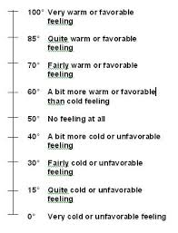
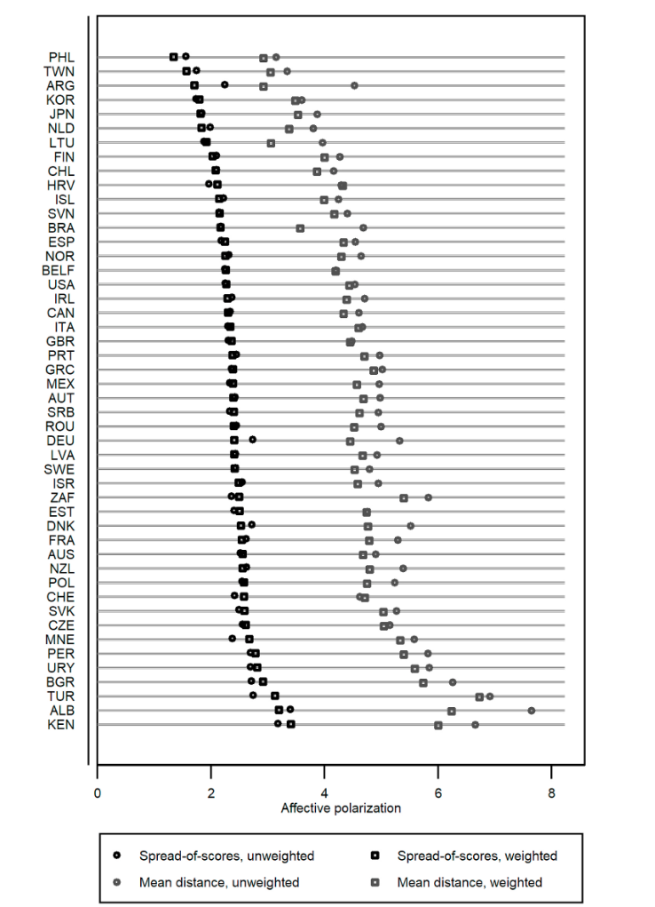
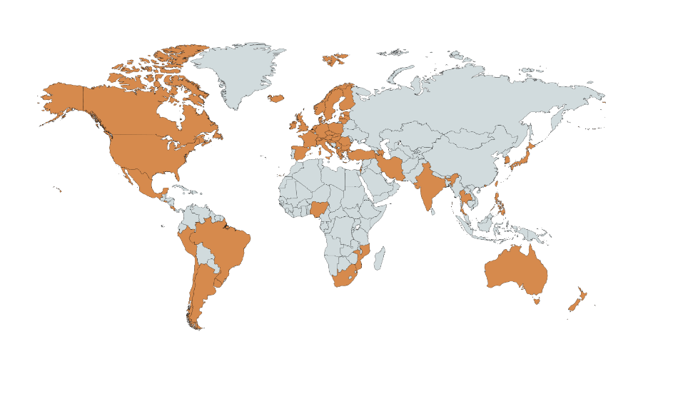
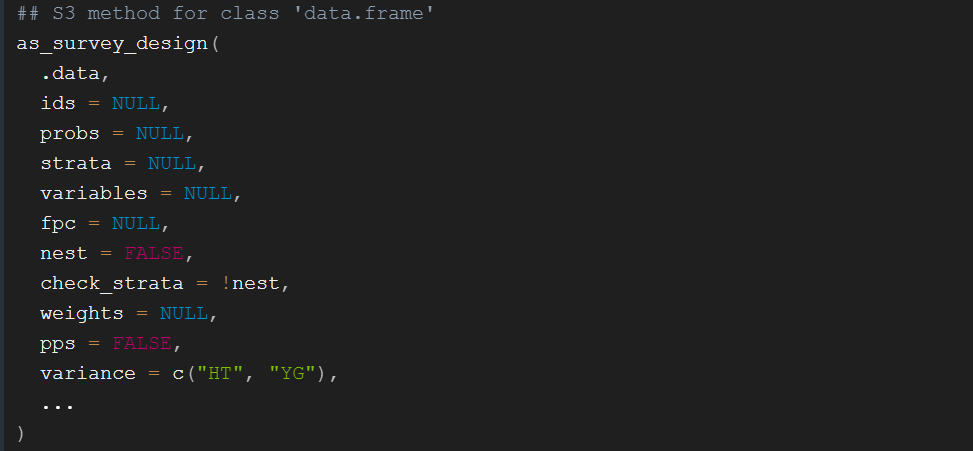

```{r setup, include=FALSE}
library(xaringanthemer)
library(kableExtra)
library(xaringan)
library(xaringanExtra)

style_duo_accent(primary_color = "#001A57",
                 secondary_color = "#708090",
                 text_font_family = "Droid Serif",
                 text_font_url = "https://fonts.googleapis.com/css?family=Droid+Serif:400,700,400italic",
                 header_font_google = google_font("Yanone Kaffeesatz"),
                 text_slide_number_color = "#000000")
knitr::opts_chunk$set(echo = FALSE)
options("kableExtra.html.bsTable" = T)

htmltools::tagList(
  xaringanExtra::use_clipboard(
    button_text = "<i class=\"fa fa-clipboard\"></i>",
    success_text = "<i class=\"fa fa-check\" style=\"color: #90BE6D\"></i>",
    error_text = "<i class=\"fa fa-times-circle\" style=\"color: #F94144\"></i>"
  ),
  rmarkdown::html_dependency_font_awesome()
)
use_xaringan_extra(c("tile_view", "animate_css", "tachyons"))
use_scribble()
use_extra_styles(
  hover_code_line = TRUE,         
  mute_unhighlighted_code = TRUE
  )  

```

class: inverse, center, middle

# Repaso polarización

---

## Polarización política (ideológica) 

- **Polarización ideológica (elites o sistema de partidos):** variación en la distribución de los partidos políticos en el eje izquierda-derecha [(Dalton, 2021)](https://www.sciencedirect.com/science/article/pii/S0261379421000652?casa_token=UvuykRFC-A8AAAAA:Fp58VZI-hdXOIXQiN9uRGs9reCsWLElTmr-j9l36WvJ6HfjSIfEULwqVI_oRLfaaHoz_Dcf_). 

  - Poca polarización dificulta la elección de los partidos para los votantes 
  
  - Mayor polarización aumenta la participación. 
  
  - Polarización muy alta puede causar dificultades para governar

- **Polarización ideológica (votantes):** qué tan extremas son las posiciones de los votantes en cuanto a preferencias por políticas públicas y cuánta distancia hay entre votantes/partidarios de distintos partidos/bloques ([Fiorina et al., 2009](https://www.journals.uchicago.edu/doi/abs/10.1017/S002238160808050X?casa_token=ozbT6OreOdgAAAAA:PXLuNMUAOMh2rrCQSk4oWFGb2lyRwwgYu9zr-WuwEX8z1D_z8gDD4wvpyniaiwPH0hqnuazXBHU) [Abramowitz y Sanders, 2008](https://www.journals.uchicago.edu/doi/abs/10.1017/S0022381608080493?casa_token=AXok-pBjVWMAAAAA:VHV8ENeremIBOQZszRTc7_O2eLo1tJQWSWxMR6Hchm76WX7WLQYTzeNcMsLZSp0dvSp7gLatT_8)). 

  - Enfoque predominante hasta 2012 (ver [Iyengar et al., 2012](https://academic.oup.com/poq/article-abstract/76/3/405/1894274)).
  
- Operacionalización: 

  - Distancia en ideología autorreportada.
  
  - Distancia y consistencia en opiniones sobre políticas públicas.


---

## Polarización política (afectiva) 

.center[
```{r, out.width = "700px"}
knitr::include_graphics("ima/figure-1.png")
```
]

.pull-right[[Iyengar et al. (2019)](https://www.annualreviews.org/content/journals/10.1146/annurev-polisci-051117-073034)]

---

## Polarización política (afectiva) 

- **Polarización afectiva:** estudia si los votantes muestran aversión, animosidad o desconfianza hacia los votantes/partidarios del otro partido [Iyengar et al., 2019](https://www.annualreviews.org/content/journals/10.1146/annurev-polisci-051117-073034). 

  - Enfoque distinto basado en la teoría de identidades sociales *(Social Identity Theory)*, originado en Estados Unidos y muy extendido en la actualidad (ej. 
[Wagner, 2021](https://www.sciencedirect.com/science/article/pii/S0261379420300822?casa_token=GT6hg0d11TAAAAAA:JlYO-9yphe6NUXxj87c6M6Q5dJn28oKJOoaUWHSe4vRaERfynq7mxTuGRyz4cB8kNfhGaw_C))
  
  - Incluso en países con bajos niveles de identificación partidaria puede existir altos niveles de polarización afectiva (ej. [Samuels y Zucco (2018)](https://books.google.es/books?hl=es&lr=&id=v9BVDwAAQBAJ&oi=fnd&pg=PR11&dq=zucco+antipartisans&ots=3OCVI9bwwk&sig=dDhOauHNhthzrpwtG8RrwAmJcZs))

  
- Operacionalización

  - Preguntas sobre gusta/disgusta partidos o votantes o termómetros de simpatía 
  
  - Medidas de distancia social (ej. preguntas sobre como se sentiría si hijo/a se casa con alguien del otro partido)
  
  - Medidas de confianza en partidarios de otros partidos/bloques.
  
  
---

## Polarización afectiva 

.pull-left[
```{r, out.width = "350px"}

```
]

.pull-right[
Escala CSES: *¿Cuánto le gusta o no le gusta cada uno de los siguientes partidos políticos? Ubique a cada uno en una escala de 0 a 10, donde 0 quiere decir que no le gusta nada y 10 que le gusta muchísimo*
]

---

## Polarización afectiva en perspectiva comparada

.center[
```{r, out.width = "350px"}

```
]

.pull-right[
[Wagner (2021)](https://www.sciencedirect.com/science/article/pii/S0261379420300822?casa_token=bCRuxxjMeGIAAAAA:aJyziDgshKWdptNPxPQ8oSvG75lBsRA3XSBeFTIVtOy1Z1ykGI_eK0gFm0dT_GCcc5Pe6ymm)
]

---
class: inverse, center, middle

# Encuestas de opinión pública en Uruguay

---

## Fuentes

- Sistema de encuestadoras privadas (~5) muy estable con larga tradición. 

  - Metodología diversa y cambiante (RDD, online, cara a cara)

  - Datos agregados publicados en medios de comunicación (ver [app política](https://bancodedatos-fcs.shinyapps.io/appPolitica/))
  
  - Datos a nivel individual de Cifra y Opción (ver [Álvarez et al., (2023)](https://scholar.google.es/citations?view_op=view_citation&hl=es&user=WmXuNEsAAAAJ&citation_for_view=WmXuNEsAAAAJ:Tyk-4Ss8FVUC)), X encuestas 1993-2019, disponibles en Roper Center.
  
- Proyectos regionales e internacionales con mediciones en Uruguay

  - [LAPOP](https://www.vanderbilt.edu/lapop/)
  
  - [Latinobarómetro](https://www.latinobarometro.org/)

  - [Encuesta Mundial de Valores](https://www.worldvaluessurvey.org/)
  
  - [CSES](https://cses.org/)
  
---

## CSES


- Proyecto colaborativo de muchas universidades desde 1996.

- Dos olas en Uruguay, la última en 2019 por Factum

- Preguntas relaciondas a elecciones 

.center[
```{r, out.width = "500px"}

```
]


---

class: inverse, center, middle

# Análisis de datos de encuestas en R

---

## Particularidades de datos de encuestas

- Datos en general categóricos con etiquetas y categorías particulares (no sabe no contesta, etc.)

- Ponderadores de post-estratificación para corregir sesgos de no respuesta.

- Muestras complejas (efecto de diseño)

- Casos perdidos

---

## Paquetes de R para analizar datos de encuestas

- El paquete [survey](https://cran.r-project.org/package=survey) permite el análisis de datos de encuestras con muestras complejas. Por ejemplo, permite obtener tablas de resumen ponderadas.

- El paquete [srvyr](http://gdfe.co/srvyr/) es la versión del tidyverse del paquete [survey](https://cran.r-project.org/package=survey).

- El paquete [anesrake](https://cran.r-project.org/web/packages/anesrake/anesrake.pdf) permite generar ponderadores de post-estratificación via raking.

.center[
```{r, out.width = "300px"}

```
]
---

## Importar datos

- Normalmente cuando trabajamos con datos solemos utilizar datos ya creados guardados en los formatos de otros programas (ej. Excel, Stata, SPSS) 

- Existen varios paquetes que permiten importar y exportar datos desde distintos formatos. Algunos de los más utilizados son [readr](https://readr.tidyverse.org/), [haven](https://haven.tidyverse.org/), [readxl](https://readxl.tidyverse.org/) y [utils](https://www.rdocumentation.org/packages/utils/versions/3.6.2)

- Datos de encuestas muchas veces son guardados en el formato de Stata (.dta) o SPSS (.sav) porque son eficientes para guardar etiquetas. El paquete [haven](https://haven.tidyverse.org/) es muy util para esto.

---

## Importar datos (ejemplo)

A partir de proyecto de R en la carpeta CSES, asignando la base al nombre df

```{r eval = FALSE, echo=TRUE}
df <- read_dta('Data/cses5_stata/cses5.dta')
```

Directorio completo:

```{r eval = FALSE, echo=TRUE}
df <- read_dta('C:/Users/opertti/Dropbox/cursos/SICCS/CSES/cses5_stata/cses5.dta')
```

---

## Etiquetas y factores

- Cuando importamos data de SPSS o Stata con variables categóricas que tienen etiquetas (ej: 1 = Aprueba; 2 = Desaprueba) con el paquete haven, por defecto el valor de las variables será el numérico (son de tipo dbl) y tendrán las etiquetas como atributos.

- En general, al trabajar en R es mejor transformar estas variables categóricas en factores. Para ello podemos usar la función `as_factor()`del paquete `haven` (no confundir con `as.factor()`)


```{r eval = FALSE, echo=TRUE}
# Etiquetas como factores
df <- df %>% 
  haven::as_factor() 
```

---

## Limpiar datos

- Las tareas clásicas de limpieza de datos como seleccionar variables, filtrar datos y recodificar variables en R se pueden hacer de distintas maneras.

- Con el paquete `dplyr` (dentro del universo `tidyverse`) podemos hacer todas estas tareas con una sintaxis en común

```{r eval = FALSE, echo=TRUE}
df <- df %>% 
  select(var_1, var_2, var_3) %>% 
  filter(var_1 == 'Uruguay') %>% 
  rename(var_1_b = var_1) %>% 
  mutate(var_3_rec = case_when(
    var_3 >= 2 ~ '2 o +',
    TRUE ~ 'Otros
  ))
```

---

## Post-estratificación

Con el paquete `anesrake` podemos ponderar con el método de raking. [Ver tutorial](https://www.r-bloggers.com/2018/12/survey-raking-an-illustration/) 

```{r eval = FALSE, echo=TRUE}
library(anesrake)

# Supongamos que quiero ponderar por sexo y el parámetro es 60% mujeres y 
# 40% hombres 
prop.table(table(df$sexo)) # Hay diferencia importante

# Creo vector con parámetro y nombro los valores 
# Tienen que coincidir con los valores de la variable
par_sexo <- c(0.6, 0.4) # Es un ejemplo, no son reales
names(par_sexo) <- c("Female", "Male")
par_sexo

# Lista con todos los parametros
parametros <- list(par_sexo) 
# Nombrar con el nombre exacto de las variables
names(parametros) <- c("sexo") 
```


---

## Post-estratificación

```{r eval = FALSE, echo=TRUE}
## Ponderador 
outsave <- anesrake(
  parametros, # Lista con parámetros 
  df, # Data 
  caseid = df$id, # Id único por caso
  cap = 5, # Fijo peso máximo de 5
  type = "nolim",
  pctlim = 5, # Si la diferencia no es > a 5% no tenga en cuenta la var
  force1 = TRUE # Asegura que cada parametro sume 1 si hay pequeñas diferencias
  )

summary(outsave) # Resumen

## Ponderador como variable
lat_17 <- df %>% 
  mutate(ponderador = unlist(outsave[1]))
```

---

## Crear objeto de encuesta

Crear un objeto de encuesta con la función `as_survey_design()` del paquete `srvyr`.

```{r eval = FALSE, echo=TRUE}
encuesta <- dataframe_original %>% 
  as_survey_design(weight = ponderador)
```

.center[
```{r, out.width = "600px"}

```
]

---

## Estadísticas de resumen ponderadas

- Usamos las funciones `survey_mean()`, `survey_total()` y `survey_quantile()` para obtener estadísticas de resumen con la sintáxis de dplyr. Por ejemplo:

```{r eval = FALSE, echo=TRUE}
# Frecuencia ponderada
svy %>%
  group_by(pid_total) %>%
  srvyr::summarize(n_pond = survey_total(vartype = NULL))
```


  
  
  
  