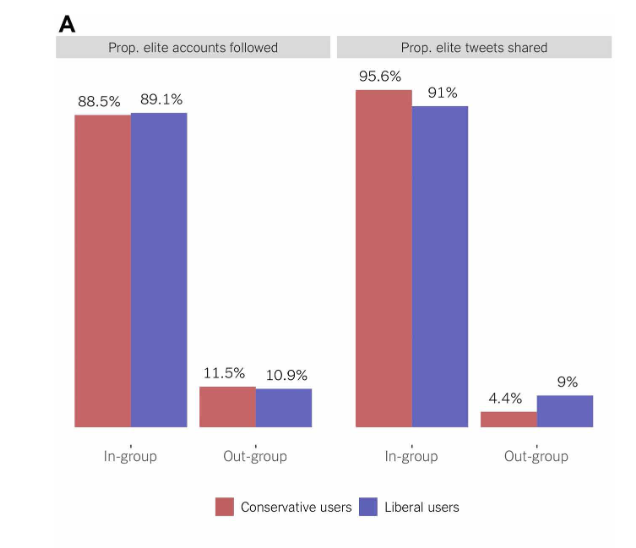

```{r setup, include=FALSE}
library(xaringanthemer)
library(kableExtra)
library(xaringan)
library(xaringanExtra)

style_duo_accent(primary_color = "#001A57",
                 secondary_color = "#708090",
                 text_font_family = "Droid Serif",
                 text_font_url = "https://fonts.googleapis.com/css?family=Droid+Serif:400,700,400italic",
                 header_font_google = google_font("Yanone Kaffeesatz"),
                 text_slide_number_color = "#000000")
knitr::opts_chunk$set(echo = FALSE)
options("kableExtra.html.bsTable" = T)

htmltools::tagList(
  xaringanExtra::use_clipboard(
    button_text = "<i class=\"fa fa-clipboard\"></i>",
    success_text = "<i class=\"fa fa-check\" style=\"color: #90BE6D\"></i>",
    error_text = "<i class=\"fa fa-times-circle\" style=\"color: #F94144\"></i>"
  ),
  rmarkdown::html_dependency_font_awesome()
)
use_xaringan_extra(c("tile_view", "animate_css", "tachyons"))
use_scribble()
use_extra_styles(
  hover_code_line = TRUE,         
  mute_unhighlighted_code = TRUE
  )  

```

## Preguntas

--

### ¿Son las redes sociales cámaras de eco?

--

### ¿Las redes sociales nos polarizan?


---
class: inverse, center, middle

# ¿De qué hablamos cuando hablamos de cámaras de eco y polarización en redes sociales?

---

## Redes sociales, política e información 

La irrupción de las redes sociales dio paso al debate de si las nuevas tecnologías darían voz a nuevos actores generando un debate **más plural** o crearían comunidades ideológicas aisladas.

--

- Los medios digitales y las redes sociales podrían bajar los **costos de adquirir información política** dando paso a un discurso político más plural. 

--

- La abundancia y capacidad de elegir la información podría llevar a un división entre los **interesados en política y los que no les interesa**.

  - Por ejemplo, [Instragram por defecto ahora bloquea el contenido politico de cuentas que el usuario no sigue.](https://about.instagram.com/blog/announcements/continuing-our-approach-to-political-content-on-instagram-and-threads)  Pero el usuario muy interesado en política puede desactivar esa condición. 
  
--

- También la tecnología facilitó la conexión con personas que piensan de forma similar a nosotros, a diferencia de la vida real donde solemos tener que enfrentarnos a la diversidad (Putnam, 2000).


---

## Cámaras de eco: argumento original

- La posibilidad de elegir qué información obtener de forma más personalizada podía llevar a que la gente consuma la información que **refuerza sus opiniones previas**, formando **cámaras de eco**.

--

- Según Sunstein (2018), uno de los principales impulsores de este argumento, esto sucedería porque: 

  - Las redes sociales permiten a los individuos encontrar gente con visiones del mundo **similares**.

--

  - La gente en cámaras de eco **pierde la visión** de la opinión de la gente del otro lado del espectro político.

--

  - Estos cambios permiten la **deliberación de enclave** (enclave deliberation) donde las conversaciones se dan entre gente que tiene ideas similares. Si bien esto puede ser positivo en algunos contextos, según Sunstein, este tipo de deliberación lleva al **extremismo** debido a que (1) al adoptar posiciones nuevas **solo pueden ser opiniones congeniales** (2) **presión social** (3) cuando estamos rodeados de gente con pensamiento similares, nos volvemos **más seguros** de que estamos en lo correcto.  
  
--

- El resultado final es una sociedad más **polarizada**.


---

## Cámaras de eco: argumento original

Tres causas principales:

- **Exposición selectiva:** evitar información que cause disonancias cognitivas 

  - Evidencia experimental muestra que las personas suelen preferir consumir medios de comunicación de su misma ideología  [Iyengar y Hahn, 2009](https://academic.oup.com/joc/article-abstract/59/1/19/4098357).

--

- **Homofilia en interacciones sociales:** contacto en interacciones sociales entre personas similares ocurre más frecuentementre entre personas similares, reflejado en matrimonios, amistades, o trabajos. [McPherson  y Smith-Lovin, 2001](https://www.annualreviews.org/content/journals/10.1146/annurev.soc.27.1.415)

--

- **Algoritmos de ranking y filtros burbuja:** algortimos que buscan maximizar el tiempo en pantalla de los usuarios y que lo consiguen evitando "disgustar" al usuario con información disonante [(Parisier, 2011)](https://books.google.es/books?hl=es&lr=&id=wcalrOI1YbQC&oi=fnd&pg=PT6&dq=pariser+filter+bubble&ots=I4c3wwIDEz&sig=il3L-uV3dFDaypwzJhm7vK6ht5s).

---

## La cámara de eco de la cámara de eco

- Esta visión está muy extendida en ciertos sectores de la academia, la prensa y la política en general

<blockquote>

Si obtienes toda tu información de algoritmos que se envían a través de tu teléfono y eso simplemente refuerza cualquier sesgo que tengas, (...) simplemente vives en una burbuja, y eso es parte de por qué nuestra política está tan polarizada en este momento.

.right[-- <cite>Barack Obama 2018</cite>]
</blockquote>

<br>

.center[
```{r, out.width = "500px"}

```
]

.center[
```{r, out.width = "500px"}

```
]

---

## Polarización política (ideológica) 

- **Polarización ideológica (elites o sistema de partidos):** distancia en la distribución de los partidos políticos en el eje izquierda-derecha [(Dalton, 2021)](https://www.sciencedirect.com/science/article/pii/S0261379421000652?casa_token=UvuykRFC-A8AAAAA:Fp58VZI-hdXOIXQiN9uRGs9reCsWLElTmr-j9l36WvJ6HfjSIfEULwqVI_oRLfaaHoz_Dcf_). 

  - Poca polarización dificulta la elección de los partidos para los votantes 
  
  - Mayor polarización aumenta la participación. 
  
  - Polarización muy alta puede causar dificultades para governar

--

- **Polarización ideológica (votantes):** qué tan extremas son las posiciones de los votantes en cuanto a preferencias por políticas públicas y cuánta distancia hay entre votantes/partidarios de distintos partidos/bloques ([Fiorina et al., 2009](https://www.journals.uchicago.edu/doi/abs/10.1017/S002238160808050X?casa_token=ozbT6OreOdgAAAAA:PXLuNMUAOMh2rrCQSk4oWFGb2lyRwwgYu9zr-WuwEX8z1D_z8gDD4wvpyniaiwPH0hqnuazXBHU) [Abramowitz y Sanders, 2008](https://www.journals.uchicago.edu/doi/abs/10.1017/S0022381608080493?casa_token=AXok-pBjVWMAAAAA:VHV8ENeremIBOQZszRTc7_O2eLo1tJQWSWxMR6Hchm76WX7WLQYTzeNcMsLZSp0dvSp7gLatT_8)). 

  - Enfoque predominante hasta 2012 (ver [Iyengar et al., 2012](https://academic.oup.com/poq/article-abstract/76/3/405/1894274)).
  
  - Operacionalización: Distancia en ideología autorreportada, distancia y consistencia en opiniones sobre políticas públicas.


---

## Polarización política (afectiva) 

.center[
```{r, out.width = "700px"}

```
]

.pull-right[[Iyengar et al. (2019)](https://www.annualreviews.org/content/journals/10.1146/annurev-polisci-051117-073034)]

---

## Polarización política (afectiva) 

- **Polarización afectiva:** estudia si los votantes muestran aversión, animosidad o desconfianza hacia los votantes/partidarios del otro partido [Iyengar et al., 2019](https://www.annualreviews.org/content/journals/10.1146/annurev-polisci-051117-073034). 

  - Enfoque distinto basado en la teoría de identidades sociales *(Social Identity Theory)*, originado en Estados Unidos y muy extendido en la actualidad (ej. 
[Wagner, 2021](https://www.sciencedirect.com/science/article/pii/S0261379420300822?casa_token=GT6hg0d11TAAAAAA:JlYO-9yphe6NUXxj87c6M6Q5dJn28oKJOoaUWHSe4vRaERfynq7mxTuGRyz4cB8kNfhGaw_C))
  
  - Incluso en países con bajos niveles de identificación partidaria puede existir altos niveles de polarización afectiva (ej. [Samuels y Zucco (2018)](https://books.google.es/books?hl=es&lr=&id=v9BVDwAAQBAJ&oi=fnd&pg=PR11&dq=zucco+antipartisans&ots=3OCVI9bwwk&sig=dDhOauHNhthzrpwtG8RrwAmJcZs))

  
- Operacionalización

  - Preguntas sobre gusta/disgusta partidos o votantes o termómetros de simpatía 
  
  - Medidas de distancia social (ej. preguntas sobre como se sentiría si hijo/a se casa con alguien del otro partido)
  
  - Medidas de confianza en partidarios de otros partidos/bloques.
  
---

## Polarización política (afectiva) 

Ejemplo de preguntas de medidas de distancia social en Brasil:

.center[
```{r, out.width = "700px"}

```
]

.pull-right[[Samuels et al., (2023)](https://www.cambridge.org/core/journals/latin-american-politics-and-society/article/partisan-stereotyping-and-polarization-in-brazil/2F11FF3E4FB1C4B37069FA05515F29DA)]


---

class: inverse, center, middle

# Cámaras de eco: la evidencia

---

## A tener en cuenta

- Literatura muy reciente

- Diferencias en acceso a datos de distintas plataformas de redes sociales.

- Dificultad para tener evidencia causal. Dos soluciones:

  - Convenios con plataformas (ej. l[os 4 artículos publicados en Science en 2023 en colaboración con Facebook.](https://www.nature.com/articles/s41586-023-06297-w))
  
  - Diseños que imiten la interfaz de redes sociales o repliquen aspectos de redes sociales en entornos controlados (ej. [Social Media Accelerator](https://osf.io/preprints/socarxiv/ucfbk))

- Efectores heterogénos: diferencias grandes entre los interesados en temas políticos y los que no

- Evidencia concentrada en Estados Unidos y algunos países europeos.

- Cambios en plataformas (nuevas plataformas, cambios en el algoritmos, etc.).

---

## Operacionalización

- Homofilia en amistades en redes (ej. [Bakshy et al., (2015)](https://www.science.org/doi/abs/10.1126/science.aaa1160))

- Homofilia en interacciones en redes según tema (ej. [Barberá et al., (2015)](https://journals.sagepub.com/doi/abs/10.1177/0956797615594620))

- Homofilia en interacciones con elites (ej. [Wojcieszak1 et al., (2022)](https://www.science.org/doi/abs/10.1126/sciadv.abn9418)
])

- Sesgos partidarios en consumo de medios en línea (ej. [Guess (2021)](https://onlinelibrary.wiley.com/doi/abs/10.1111/ajps.12589?casa_token=I4U9n2pMzy4AAAAA:zySvJZERKVLNXUgvG6DX8oC8s6_kjGWGg4mDIDIh0jYV-gE-Vb8bSI9acy0rNFW163KBGnDU3p7DbqE))

- Datos de exposición a contenido (ej. [Nyhan et al., (2023)](https://www.nature.com/articles/s41586-023-06297-w))

---

## Primeras Investigaciones

- Un estudio analizó hipervínculos entre blogs políticos de cara a la eleccion de 2004 en Estados Unidos encontraron que no casi había enlaces entré la comunidad relacionada al partido Demócrata y la del Partido Republicano [(Adamic y Glance, 2005)](https://dl.acm.org/doi/abs/10.1145/1134271.1134277?casa_token=T08X6iwjTCUAAAAA:c-itEvNdDhZraiAZFvLmHvXl26mQ13aX-VkvG-lFweUidcBxgvAtk7SoMvWYi_uJr9itX-3VYZL3hg). 

--

- Otra investigación encontró que los lectores de blog también consumían los blogs de su propia orientación partidaria predominantemente [(Lawrence, Sides, and Farrell, 2010)](https://www.cambridge.org/core/journals/perspectives-on-politics/article/selfsegregation-or-deliberation-blog-readership-participation-and-polarization-in-american-politics/00D2B6743AAF448CDD1DA4FBB913BB05)

--

- Estudio de retweets de tweets con hashtags usados en la campaña de 2012 mostró que los usuarios son más propensos a retuitear mensajes de su misma ideología [(Conover, 2012)](https://link.springer.com/article/10.1140/epjds6)

--

- Otro estudio mostró que el 75% de los retuits de temas políticos eran realizados entre usuarios de la misma ideología [(Barberá et al., 2015)](https://journals.sagepub.com/doi/abs/10.1177/0956797615594620)

--

- Un estudio basado en datos de Facebook encontró que el 70% de las amistades son entre personas de la misma orientación partidaria/ideológica y que alrededor del 20% se da entre orientaciones políticas opuestas [Bakshy et al., 2015](https://www.science.org/doi/abs/10.1126/science.aaa1160)

---

## Primeras Investigaciones

.center[
```{r, out.width = "700px"}
knitr::include_graphics("ima/barbera_1.png")
```
]

.pull-right[[(Barberá et al., 2015)](https://journals.sagepub.com/doi/abs/10.1177/0956797615594620)]

---

## Primeras Investigaciones

.center[
```{r, out.width = "700px"}

```
]

.pull-right[[(Barberá et al., 2015)](https://journals.sagepub.com/doi/abs/10.1177/0956797615594620)]]

---

## Primeras Investigaciones

Redes de rewteets relacionadas a la campaña de la elección estadounidense de 2012

.pull-left[
```{r, out.width = "700px"}

```
]

.pull-right[

```{r, out.width = "700px"}

```
]

.pull-left[[(Conover, 2012)](https://link.springer.com/article/10.1140/epjds6)]

.pull-right[[(Barberá et al., 2015)](https://journals.sagepub.com/doi/abs/10.1177/0956797615594620)]]

---

## En Uruguay

.center[
```{r, out.width = "450px"}

```
]

.pull-right[[Bogliaccini et al., (2019)](http://liberi.ucu.edu.uy/xmlui/handle/10895/1454)]


---

## Interacciones con elites políticas

.pull-left[

- Estudio de muestra aleatoria de 1.5 millones de usuarios en Twitter y sus patrones de seguimiento a otros usuarios y retuiteo. 

- 60% no sigue a ninguna elite política

- Dentro de los que siguen a elites políticas, el usuario típico sigue un 90% a elites de su propia orientación política y 10% de otras orientaciones.

- Los posteos de usuarios del mismo partido son retuiteados 13 veces más que los mensajes enviados por elites del otro lado del espectro político.]


.pull-right[
.center[
```{r, out.width = "400px"}

```
]

[Wojcieszak1 et al., (2022)](https://www.science.org/doi/abs/10.1126/sciadv.abn9418)
]

---

## Consumo de noticias

- [Guess (2021)](https://onlinelibrary.wiley.com/doi/abs/10.1111/ajps.12589?casa_token=I4U9n2pMzy4AAAAA:zySvJZERKVLNXUgvG6DX8oC8s6_kjGWGg4mDIDIh0jYV-gE-Vb8bSI9acy0rNFW163KBGnDU3p7DbqE) que combina datos de una encuesta y datos del historial de navegación de los encuestados  muestra como Demócratas y Republicanos suelen usar en gran medida los mismos medios de comunicación para informarse. Un pequeño grupo de partidarios si consume mayoritariamente sitios partidarios.

--

- Consumo de noticias en redes también parece provenir de fuentes diversas, con muchas superposición entre seguidores de distintos partidos. Sin embargo, algunos usuarios no siguen casi cuentas de medios del otro extremo del espectro político, particularmente personas de izquierda no consumen casi medios de derecha  [(Eady et al., 2019)](https://journals.sagepub.com/doi/abs/10.1177/2158244019832705).

--

- Varios estudios muestran que el consumo de noticias online no está más fragmentado que el consumo de noticias offline, a causa de la exposición incidental (ej. [Fletcher y Nielsen, 2017](https://academic.oup.com/joc/article-abstract/67/4/476/4642154))

--

- Sin embargo, un artículo reciente muestra que si bien los personas en general siguen/difunden contenido proveniente de cuentas de diversa orientación ideológica, cuando se miran los datos a nivel publicación o posteo, los segos son muchos grandes. Esto proviene de un fenómeno llamado burbujas de curación *(curation bubbles)* [(Green et al., forthcoming)](https://files.osf.io/v1/resources/udfaz/providers/osfstorage/6101ce1b317620027237dc3a?action=download&direct&version=4) 

---

## Consumo de noticias

.pull-left[
Porcentaje de encuestados que viven en una 'cámara de eco'. Estimación a partir de datos de encuestas, donde los encuestados reportan que medios de comunicación consumió en la última semana y reportan su autoidentificación ideológica y calculan el % de personas en cámaras de eco como el porcentaje de personas que solo consumieron medios de izquierda o derecha (con distintos umbrales). ]

.pull-right[
```{r, out.width = "500px"}

```
]

.pull-right[[(Fletcher et al., 2021)](https://journalqd.org/article/view/2585)]


---

## Consumo de noticias

.pull-left[
Distribución de la ideología de los medios consumidos por independientes, demócratas y republicanos usando datos de historial de búsqueda y una encuesta. 65% de superposición entre demócratas y republicanos en la distribución de la **ideología promedio** de los medios que consumen.
]

.pull-right[
```{r, out.width = "400px"}

```
]

.pull-right[[(Guess, 2021)](https://onlinelibrary.wiley.com/doi/abs/10.1111/ajps.12589?casa_token=ROJCp7eBmdIAAAAA:eMzr-yDV_kAH6WkfVT8cICwQgEYqAutIjkwZZvgX-whjCEHTxCBQaREVeY5dJaCF7dsd5EP_BYdFzKk)]

---

## Burbujas de curación

.center[
```{r, out.width = "700px"}

```
]

.pull-right[[(Green et al., forthcoming)](https://files.osf.io/v1/resources/udfaz/providers/osfstorage/6101ce1b317620027237dc3a?action=download&direct&version=4) ]

---

## Burbujas de curación

.center[

```{r, out.width = "700px"}

```
]

.pull-right[[(Green et al., forthcoming)](https://files.osf.io/v1/resources/udfaz/providers/osfstorage/6101ce1b317620027237dc3a?action=download&direct&version=4) ]


---

## Resumen

- Homofilia pero no aislamiento en amistades en redes sociales

--

- Alta homofilia en interacciones sobre temas políticos e interacciones con elites políticas. 

--

- Poca homofilia en temas no políticos o interacciones que permiten disentir.

--

- Consumo de medios es más balanceado de lo esperado por la teoría de la exposición selectiva, aunque con matices.

--

- Debido a esto, la evidencia hasta el momento es en contra del argumento original de las cámaras de eco, o está reducido a un procentaje pequeño del electorado. 


---

## ¿Por qué?

- Si las redes sociales nos permiten elegir qué contenido recibir, ¿por qué estamos expuetos a información contra-atitudinal? Dos razones principales:

  - La exposición es mayormente **incidental**. Las redes sociales cumplen muchas más funciones que informarse sobre política:  la gente usa las redes para consumo de contenido **no político** en mayor medida que contenido político. Esto lleva a los usuarios a estar expuestos incidentalmente a contenido que no va de la mano de sus actitudes previas. 

.pull-left[ 

   - Parte de la exposición a información contra-atitudinal se debe a los **lazos débiles** (*weak ties*, ver [Granovetter, 1977](https://www.journals.uchicago.edu/doi/abs/10.1086/225469)), donde seguimos a conocidos, compañeros de trabajo, amigos de la escuela y personas no cercanas pero con las que tenemos una relación, que tienden a no ser tan similares políticamente como los círculos más cercanos.

]

.pull-right[.center[
```{r, out.width = "500px"}

```
]
]

---

class: inverse, center, middle

# ¿Las redes sociales nos polarizan?

---

## Polarización política y redes sociales

- Las cámaras de eco son solo uno de los mecanismos por los que las redes sociales pueden llevar a aumentar la polarización afectiva.

--

- La saliencia de las identidades políticas en redes o la incivilidad y el tono del discurso son otros mecanismos por los que las redes sociales pueden aumentar la polarización política (Settle, 2018).

--

- Entonces, ¿Las redes sociales nos polarizan?

---

## Polarización política y redes sociales

- Uno de los primeros estudios importantes del tema es el de [Boxwell et al., (2017)](https://www.pnas.org/doi/abs/10.1073/pnas.1706588114), que encuentra que si bien la polarización política aumentó en EEUU en todos las cohortes de edad, el aumento fue el menor entre los jóvenes (quienes más usan redes sociales) usando datos de encuestas (del ANES).

.center[
```{r, out.width = "600px"}

```
]

.pull-right[[(Boxwell et al., 2017)](https://www.pnas.org/doi/abs/10.1073/pnas.1706588114)]


---

## Polarización política y redes sociales

[Bail et al., (2018)](https://www.pnas.org/doi/abs/10.1073/pnas.1804840115) tomó una muestra de estadounidenses que usa Twitter al menos 3 veces por semana realizó un experimento. El tratamiento consistía en seguir a un bot de Twitter por un mes, que compartía mensajes de la posición política opuesta. Los encuestado republicanos se mostraron más consevadores después de recibir el tratamiento, los demócratas un poco más liberales.

.center[
```{r, out.width = "700px"}
knitr::include_graphics("ima/bail.png")
```
]

.pull-right[[(Bail et al., 2018)](https://www.pnas.org/doi/abs/10.1073/pnas.1804840115)]


---

## Polarización política y redes sociales

.pull-left[

- [Allcott et al., (2020)](https://www.aeaweb.org/articles?id=10.1257%2Faer.20190658&utm_campaign=Johannes) llevaron a cabo un experimento en donde el tratamiento consistía en 
desctivar Facebook por 4 semanas previo a las elecciones presidenciales de EEUU en 2018.

- No encontraron efectos del tratamiento en polarización afectiva pero si disminuyó la polarización respecto a posiciones de políticas públicas (qué tan de acuerdo está un individuo con las posiciones promedio de su partido). Desactivar Facebook causó que demócratas y republicanos muevan sus posiciones hacia el centro.
]

.pull-right[
```{r, out.width = "800px"}

```

[(Allcott et al., 2020)](https://www.aeaweb.org/articles?id=10.1257%2Faer.20190658&utm_campaign=Johannes)]

---

## Polarización política y redes sociales

En una colaboración con Facebook (Meta) previo a las elecciones de 2020, un equipo de más de 30 investigadores llevaron a cabo varios estudios -de los cuales hasta el momento se han publicado 4- con diseños de investigación muy sólidos en términos de validez interna y externa, que solo lo permite el trabajo en conjunto con una plataforma.

Uno de los artículos, el de [Nyhan et al., (2023)](https://www.nature.com/articles/s41586-023-06297-w) analizó la orientación política del contenido al que están expuestos los usuarios en Facebook y llevó a cabo un experimento a gran escala donde redujeron el contenido creado por fuentes del mismo partido que los participantes.

---

## Polarización política y redes sociales

Principales resultados del estudio de [Nyhan et al., (2023)](https://www.nature.com/articles/s41586-023-06297-w):

--

- El usuario mediano de Facebook recibe 50% de su contenido (político o no) de fuentes similares ideológicamente, y un 15% de fuentes del otro lado del espectro político.

--

- La mediana del porcentaje de contenido político que reciben las personas en Facebook es de 7%.

--

- Solo 1 de cada 5 usuarios de Facebook recibe el 75% o más de su contenido de fuentes de la misma orientación política.

--

- El experimento constó en reducir de ~50% a ~35% el contenido de fuentes de la misma ideología que el usuario, durante 3 meses para ~23000 usuarios, cambiando el algoritmo del feed de Facebook.  

  - No hubo efectos significativos en el tiempo destinado a la plataforma.
  
  - No hubo efectos significativos en actitudes, en ninguna de las medidas de polarización.

---

## Polarización política y redes sociales

- Los usuarios en Facebook en general no viven en cámaras de eco pero si están expuestos a mucho más contenido de fuentes de la misma orientación política.

.center[
```{r, out.width = "600px"}

```
]

.pull-right[[(Nyhan et al., 2023)](https://www.nature.com/articles/s41586-023-06297-w)]

---

## Polarización política y redes sociales

.center[
```{r, out.width = "600px"}

```
]

.pull-right[[(Nyhan et al., 2023)](https://www.nature.com/articles/s41586-023-06297-w)]


---

## Polarización política y redes sociales

- Otro de los artículos de la colaboración con Meta, [Guess et al., (2023)](https://www.science.org/doi/abs/10.1126/science.add8424) analiza el efecto de el contenido reposteado (reshares), mediante un experimento que quita los reshares del feed de grupo de tratamiento. Encuentran que:

  - Disminuye la cantidad de clicks y reacciones.
  
  - Disminuye el conocimiento de noticias políticas.
  
  - No tiene efecto en polarización ideológica o afectiva.

- Otro de los artículos, [Guess et al., (2023)](https://www.science.org/doi/abs/10.1126/science.abp9364) llevó a cabo un experimento donde asignaron a una muestra aleatoria de usuarios un feed en orden cronológico reverso. Encontraron que:

  - Disminuyó el tiempo destinado a la plataforma.
  
  - Disminuyó la cantidad de contenido político
  
  - Aumentó el contenido de fuentes moderadas
  
  - No tiene efecto en polarización ideológica o afectiva.


<!-- --- -->

<!-- ## Polarización política y redes sociales -->

<!-- Los algoritmos de ranking generan mucho más interacciones que el orden cronológico reverso. -->

<!-- .center[ -->
<!-- ```{r, out.width = "400px"} -->
<!--  -->
<!-- ``` -->
<!-- ] -->

<!-- .pull-right[[Guess et al., (2023)](https://www.science.org/doi/abs/10.1126/science.abp9364)] -->


<!-- --- -->

<!-- ## Polarización política y redes sociales -->

<!-- Los algortimos de ranking tienen consecuencias en el tipo de contenido al que las personas son expuestas: menos contenido político, menos contenido moderado, más contenido incivil. -->

<!-- .center[ -->
<!-- ```{r, out.width = "350px"} -->
<!--  -->
<!-- ``` -->
<!-- ] -->

<!-- .pull-right[[Guess et al., (2023)](https://www.science.org/doi/abs/10.1126/science.abp9364)] -->


---

## Resumen


- Aumentar la exposición a contenido de otra ideología aumentó levemente la polarización.

--

- Dejar de usar Facebook disminuyó un poco la polarización ideológica (no afectiva) y aumentar exposición a información del otro lado del espectro político aumentó la polarización ideológica.

--

- Al menos en intervenciones de 3 meses, ni quitar algoritmos de ranking, ni quitar la exposición a reposteos, ni reducir el contenido de fuentes congeniales disminuyó la polarización ideológica o afectiva.

--

- Es necesario más investigación.


---

class: inverse, center, middle

# Cámaras de eco, homofilia y exposición selectiva en Uruguay

---

## Preguntas

--

### ¿Los uruguayos políticamtente activos en Twitter/X solo siguen usuarios de su propia ideología/partido?

--

### ¿Los uruguayos políticamtente activos en Twitter/X solo interactúan con usuarios su propia ideología/partido?

--

### ¿Los uruguayos políticamtente activos en Twitter/X solo consumen medios de comunicación de su propia ideología/partido?


---

## Descripción del Proyecto

.center[
```{r, out.width = "400px"}

```
]


---

## Datos (Descargas iniciales)

- Todos los retweets, respuestas y menciones a los tweets de un conjunto de elites políticas (senadores eintendentes) en 2021. Total de 93.339 usuarios únicos generaron 2.119.915 interacciones.

- Todos los tuits, retuits que contienen palabras claves relacionadas a 47 temas políticos que ocurrieron durante 2021 en Uruguay (ej. LUC, renuncia de ministros, etc.). Total de 88.537 usuarios únicos generaron 1.190.353 posteos.

- Obtuve una estimación de la ideología de 43.914 usuarios que generaron al menos 3 interacciones en las dos bases de datos anteriores, sus cuentas continuaban activas para agosto 2022 y seguían al menos 3 cuentas políticas de sobre un conjunto de 350 cuentas de políticos y agrupaciones políticas. 

  - Estos usuarios generan el 90% del contenido político uruguayo en Twitter.


---

## Datos (PAUTU)

- Para los 43.914 PAUTU identificados, obtuve sus últimos 150 likes en agosto de 2022 sumando  6.069.588 likes en total. 

- Para los 43.914 PAUTU identificados, obtuve:

  - Sus últimos 200 interacciones (tweets originales, retweets, respuestas y quotes) que aparecían en su timeline en agosto de 2022 sumando 8.191.526 en interacciones total.

  - Sus últimos 200 interacciones (tweets originales, retweets, respuestas y quotes) que aparecían en su timeline en agosto de 2022 sumando 8.191.526 en interacciones total.

  - Todos los usuarios a los que seguían

---

## Precauciones del caso

- Es solo Twitter

- Usuarios activos políticamente

- Datos de 2021/2022

- En revisión


---

class: inverse, center, middle

# Estimación de ideología

---

## Método para estimar ideología

- Adaptación del método de [Barberá (2015)]() que es muy utilizado y ha sido validado a nivel agregado e individual en Estados Undios y Europa.

- Está basado en que las elites políticas a las que seguimos son indicativos de nuestra orientación ideológica. La probabilidad de seguir a una elite política es inversamente proporcional a la distancia entre el usuario y la elite política en un espacio ideológico latente.

- Se estima a partir de correspondence analysis.

---

## Distribucion de la estimación de ideología

- La estimación es continua, con media 0 y desvío estandar 1.

  - Versión discreta con umbrales -0,5 y 0,5


.center[
```{r, out.width = "600px"}

```
]

---

## Validación de la estimación de ideología

.center[
```{r, out.width = "700px"}

```
]

---

class: inverse, center, middle

# Homofilia en usuarios seguidos

---

## Número de usuarios seguidos según congruencia ideológica

- El número de usuarios seguidos de ideología opuesta del usuario mediano es 7.

.center[
```{r, out.width = "600px"}

```
]

---

## % de usuarios seguidos según congruencia ideológica

- El % de usuarios seguidos de ideología opuesta del usuario mediano es 5%.

.center[
```{r, out.width = "600px"}

```
]

---

## Red de seguidores

.center[
```{r, out.width = "800px"}

```
]

---

class: inverse, center, middle

# Homofilia en interacciones

---

## Homofilia por tema y tipo de interacción

.center[
```{r, out.width = "700px"}

```
]


---

## Homofilia por tema y tipo de interacción

.center[
```{r, out.width = "700px"}

```
]


---

## Homofilia por tema y tipo de interacción

.center[
```{r, out.width = "700px"}

```
]

---

## Homofilia por tema y tipo de interacción

.center[
```{r, out.width = "700px"}

```
]

---

## Red de retweets de política entre PAUTUs

.center[
```{r, out.width = "700px"}

```
]

---

## Red de retweets de deportes entre PAUTUs

.center[
```{r, out.width = "700px"}

```
]

---

## Red de likes de política entre PAUTUs

.center[
```{r, out.width = "700px"}
knitr::include_graphics("ima/red_pautu_3.png")
```
]

---

## Red de likes de deportes entre PAUTUs

.center[
```{r, out.width = "700px"}

```
]

---

## Red de replies de política entre PAUTUs

.center[
```{r, out.width = "700px"}

```
]

---

## Red de replies de deportes entre PAUTUs

.center[
```{r, out.width = "700px"}

```
]

---

## Red según interacción y tema 

.center[
```{r, out.width = "450px"}

```
]

---

## Homofilia en interacciones según espacio de comunicación

.center[
```{r, out.width = "400px"}
knitr::include_graphics("ima/metrics.png")
```
]

---

class: inverse, center, middle

# Exposición selectiva en consumo de medios de comunicación

---

## Exposición selectiva en consumo de medios

Audiencia de distintos medios y su puntaje ideológico promedio (audience score)

.center[
```{r, out.width = "600px"}

```
]
---

## Exposición selectiva en consumo de medios

- 20,000 usuarios de derecha, 18,000 de izquierda y 5,500 moderados

- Dentro de los usuarios de izquierda, el % que sigue solamente a medios con un puntaje de -0.5 o menos es 2%.

.center[
```{r, out.width = "650px"}

```
]


---

class: inverse, center, middle

# Apuntes finales

---

## Apuntes finales

- Altos niveles de homofilia política en decisiones de a qué usuarios seguir, pero no asilamiento.

- Altos niveles de homofilia política en interacciones en Twitter entre usuarios politicamente activos, aunque con variaciones importantes según tema e interacción. 

- Considerable superposición en medios seguidos en Twitter entre los dos bloques ideológicos/partidarios, con ciertos medios con una marcada inclinación ideológica en su audiencia.

- No son pruebas directas pero la evidencia parece ser coincidente con otros estudios a nivel internacional en que la mayoría de los usuarios políticamente activos tienen comportamientos con un alto nivel de homofilia pero no viven en cámaras de eco. 

- Agenda a futuro: incivilidad de elites y polarización, otras redes, etc.


